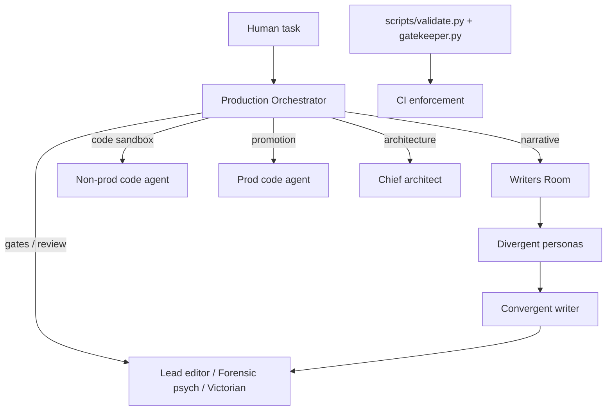

# Agent system — start here

This repository uses **documentation-driven agent orchestration**: specialist roles are markdown rule files; a single **Production Orchestrator** classifies your request and tells you which role to load next. There is no in-repo LLM runtime — you paste rule files as system prompts (Cursor, Claude Code, VS Code, etc.).

## Quick start (zero prior knowledge)

Pick an **entry lane**, paste the rule file (or enable the matching skill), describe your task in plain language.

| Lane | Load as system prompt | Example prompt |
|------|------------------------|----------------|
| Technical production | [`.agents/rules/orchestrator.md`](.agents/rules/orchestrator.md) | "Produce day 106: Cora finds the ledger discrepancy" → `produce-day` |
| Prose-first (Writer) | [`.agents/rules/writers_desk.md`](.agents/rules/writers_desk.md) or a `writer_*` skill | "Write the Day 3 corridor scene where Cora hides the letters" → `writer-author` |
| Documentation hygiene | [`.agents/rules/documentation_steward.md`](.agents/rules/documentation_steward.md) | "Documentation audit — sync READMEs" → `documentation-audit` |

**Full skill index:** [`docs/agents/SKILL_CATALOG.md`](docs/agents/SKILL_CATALOG.md) (skill → agent → pipeline → contract).

**More examples (technical lane via orchestrator):**

| You say | Pipeline |
|---------|----------|
| "Review day 103 for canon and history" | `review-scene` |
| "Promote day 105 to production" | `promote-day` |
| "Tune this scene to spice level 3" | `spice-tune` |
| "F95 market review of prod" | `market-review` |
| "Can Cora have a typewriter in 1891?" | `historical-check` |

If the orchestrator is unsure (e.g. bare "assess prod"), it will ask **one** clarifying question before routing.

## Architecture (30-second mental model)



- **Orchestrator** — routes only; does not write content.
- **Writers' room** — owns creative prose in `narrative/draft/` and `narrative/pipeline/`.
- **Code agents** — wrap or promote `.rpy` with **verbatim** creative text.
- **Gates** — narrative, psychology, then Victorian (sequential on promotion drafts).
- **Scripts** — enforce file permissions and contracts after edits (not model invocation).

## Documentation map

| Document | Purpose |
|----------|---------|
| [`.agents/README.md`](.agents/README.md) | Agent catalog, skills, folder layout |
| [`docs/agents/GETTING_STARTED.md`](docs/agents/GETTING_STARTED.md) | Step-by-step for first-time users |
| [`docs/agents/PIPELINE_REFERENCE.md`](docs/agents/PIPELINE_REFERENCE.md) | All pipelines, triggers, stages |
| [`docs/agents/SKILL_CATALOG.md`](docs/agents/SKILL_CATALOG.md) | **Canonical** skill → agent → pipeline → contract index |
| [`docs/agents/CONTRACTS.md`](docs/agents/CONTRACTS.md) | Handoffs, guardrails, validation tools |
| [`docs/agents/BRANCH_WORKFLOW_CONTRACT.md`](docs/agents/BRANCH_WORKFLOW_CONTRACT.md) | Branch/worktree hygiene for multi-tool agent handoffs |
| [`docs/narrative_workflow.md`](docs/narrative_workflow.md) | MVP narrative loop (human-readable) |
| [`.guardrails.yml`](.guardrails.yml) | Which agent may edit which paths |

## Specialist agents (rule file paths)

Load the linked `.md` file as the **full system prompt** when the orchestrator names that agent.

| Agent | Rule file | Writes? |
|-------|-----------|---------|
| Production Orchestrator | [`.agents/rules/orchestrator.md`](.agents/rules/orchestrator.md) | No |
| Writers' room | [`.agents/rules/writers_room.md`](.agents/rules/writers_room.md) | Yes (non-canon narrative) |
| Divergent writer | [`.agents/rules/divergent_writer_base.md`](.agents/rules/divergent_writer_base.md) + one section of [personas](.agents/rules/divergent_writer_personas.md) | Yes (spec scripts) |
| Convergent writer | [`.agents/rules/convergent_writer.md`](.agents/rules/convergent_writer.md) | Yes |
| Lead narrative editor | [`.agents/rules/lead_narrative_editor.md`](.agents/rules/lead_narrative_editor.md) | Gate only |
| Forensic psychology consultant | [`.agents/rules/forensic_psychology_consultant.md`](.agents/rules/forensic_psychology_consultant.md) | Profiles / gate |
| Victorian consultant | [`.agents/rules/victorian_consultant.md`](.agents/rules/victorian_consultant.md) | Gate / briefs |
| Spiciness tuning agent | [`.agents/rules/spiciness_tuning_agent.md`](.agents/rules/spiciness_tuning_agent.md) | Variants / briefs |
| Adult market reviewer | [`.agents/rules/adult_market_reviewer.md`](.agents/rules/adult_market_reviewer.md) | **Read-only** |
| Non-prod code agent | [`.agents/rules/non_prod_code_agent.md`](.agents/rules/non_prod_code_agent.md) | Sandbox `.rpy` |
| Scene direction agent | [`.agents/rules/scene_direction_agent.md`](.agents/rules/scene_direction_agent.md) | Sandbox `.rpy` (`[asset auto]` lines only) |
| Prod code agent | [`.agents/rules/prod_code_agent.md`](.agents/rules/prod_code_agent.md) | `renpy_project/` |
| Chief architect | [`.agents/rules/chief_architect.md`](.agents/rules/chief_architect.md) | Architecture / review |
| Gatekeeper orchestrator | [`.agents/rules/gatekeeper_orchestrator.md`](.agents/rules/gatekeeper_orchestrator.md) | PR / domain checks |
| Documentation steward | [`.agents/rules/documentation_steward.md`](.agents/rules/documentation_steward.md) | README/docs/spec sync + catalogue |
| Writer's Desk (prose-first concierge) | [`.agents/rules/writers_desk.md`](.agents/rules/writers_desk.md) | `intents/**`, `exceptions/**` only — routes to `writer-author`, `revise-narrative`, `rewrite-narrative`, `flag-wiring-only` |

Writers' room sub-index: [`.agents/rules/writers_room/README.md`](.agents/rules/writers_room/README.md).

## Cursor skills

Skills under [`.agents/skills/`](.agents/skills/) are thin wrappers: each loads an agent rule, names one pipeline (or cross-cutting step), and lists contracts/commands.

**Canonical table (skill → agent → pipeline → contract):** [`docs/agents/SKILL_CATALOG.md`](docs/agents/SKILL_CATALOG.md)

| Category | Skills |
|----------|--------|
| **Entry** | `orchestrator`, `documentation_audit` |
| **Pipeline (1:1)** | `produce_day`, `writer_write_scene`, `promote_day`, `review_scene`, `revise_narrative`, `rewrite_narrative`, `implement_spec`, `market_review`, `spiciness_tuner`, `historical_check`, `storyboard_sync`, `dag_tag_update` |
| **Writer's Desk** | `writer_rewrite_scene`, `writer_add_flag`, `writer_add_effect`, `writer_add_branch`, `writer_write_book`, `writer_contract_check`, `writer_log_exception`, `writer_status` |
| **Cross-cutting** | `scene_direction`, `check_assets`, `branch_handoff`, `divergent_writer`, `convergent_writer` |
| **Planning** | `daily_standup`, `action_from_standup` |
| **Specialist** | `book_writing_engine`, `art_production` |


## Pipeline helper (manual chaining)

Print which rule file to load next:

```powershell
py scripts/agent_next_step.py --list-pipelines
py scripts/agent_next_step.py --pipeline produce-day --stage 1 --day 105 --release release-1-mvp
```

## Standup → action (code & prose agents)

Point agents at `narrative/draft/releases/release-1-mvp/planning/daily_standup_report.md`, then:

```powershell
py scripts/resolve_work_item.py --from-standup --next
```

Maps queue items to specs via [`docs/backlog/task_registry.json`](docs/backlog/task_registry.json). See [`action_from_standup`](.agents/skills/action_from_standup/SKILL.md) and [`planning/standup_agent_contract.md`](narrative/draft/releases/release-1-mvp/planning/standup_agent_contract.md).

## Validation (after agents edit files)

```powershell
# Pre-PR contract bundle (includes writers' room pipeline + gates)
py scripts/orchestrate_review.py --files "path/to/day105_non_canon.rpy"

# Same checks CI runs
py scripts/validate.py --profile changed --agent human --files "path/to/file"

# WIP draft (skip gate files while iterating)
py scripts/validate.py --profile changed --agent writers_room --skip-gate-checks --files "..."

# Pre-promotion (require all three gate verdict files)
py scripts/validate.py --profile changed --agent human --strict-gates --files ".../dayrdd_non_canon.rpy"
```

CI validates convergent reports, spec scripts, gate markdown **and JSON sidecars** when any gate exists for that day. Schemas: [`docs/contracts/`](docs/contracts/README.md). See [`docs/agents/CONTRACTS.md`](docs/agents/CONTRACTS.md).

```powershell
py scripts/contract_validate.py --day day105 --release release-1-mvp
py scripts/documentation_audit.py --write
py scripts/documentation_audit.py --check
```

## Backlog (not in MVP scope)

| Item | Doc |
|------|-----|
| JSON beat pipeline | [`docs/backlog/narrative-json-beat-pipeline.md`](docs/backlog/narrative-json-beat-pipeline.md) |
| Editors-desk writing mechanic | [`docs/backlog/editors-desk-writing-mechanic.md`](docs/backlog/editors-desk-writing-mechanic.md) |

Orchestration stays **prompt-chaining** (no in-repo LLM task queue).

## Do not use

- **`.claude/worktrees/`** — stale Claude Code mirrors (gitignored). Close Claude Code and delete the folder locally if it still exists; never edit files there.
- **`narrative/pipeline/**/ideas/`** or **`synthesis/`** for new day assignments — context firewall (see [`narrative/README.md`](narrative/README.md)).
