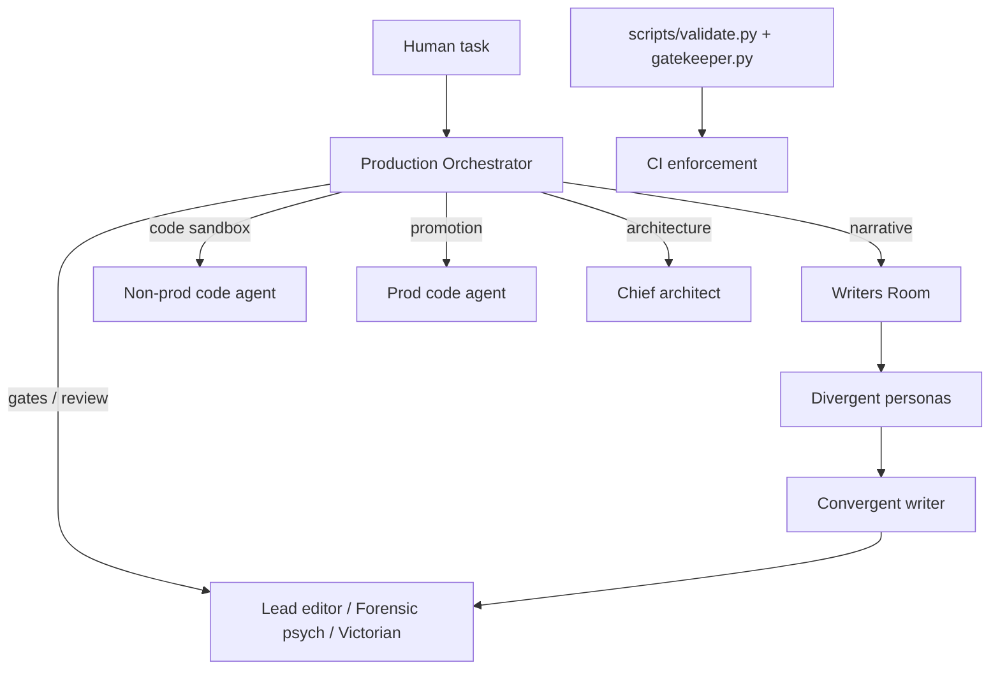

# Agent system — start here

This repository uses **documentation-driven agent orchestration**: specialist roles are markdown rule files; a single **Production Orchestrator** classifies your request and tells you which role to load next. There is no in-repo LLM runtime — you paste rule files as system prompts (Cursor, Claude Code, VS Code, etc.).

## Quick start (zero prior knowledge)

1. Open [`.agents/rules/orchestrator.md`](.agents/rules/orchestrator.md).
2. Paste the **entire file** as the system prompt for your AI session.
3. Describe your task in plain language.

**Examples:**

| You say | Orchestrator runs |
|---------|-------------------|
| "Produce day 106: Cora finds the ledger discrepancy" | `produce-day` |
| "Review day 103 for canon and history" | `review-scene` |
| "Promote day 105 to production" | `promote-day` |
| "Tune this scene to spice level 3" | `spice-tune` |
| "F95 market review of prod" | `market-review` |
| "Can Cora have a typewriter in 1891?" | `historical-check` |

If the orchestrator is unsure (e.g. bare "assess prod"), it will ask **one** clarifying question before routing.

## Architecture (30-second mental model)



- **Orchestrator** — routes only; does not write content.
- **Writers' room** — owns creative prose in `narrative/draft/` and `narrative/pipeline/`.
- **Code agents** — wrap or promote `.rpy` with **verbatim** creative text.
- **Gates** — narrative, psychology, then Victorian (sequential on promotion drafts).
- **Scripts** — enforce file permissions and contracts after edits (not model invocation).

## Documentation map

| Document | Purpose |
|----------|---------|
| [`.agents/README.md`](.agents/README.md) | Agent catalog, skills, folder layout |
| [`docs/agents/GETTING_STARTED.md`](docs/agents/GETTING_STARTED.md) | Step-by-step for first-time users |
| [`docs/agents/PIPELINE_REFERENCE.md`](docs/agents/PIPELINE_REFERENCE.md) | All pipelines, triggers, stages |
| [`docs/agents/CONTRACTS.md`](docs/agents/CONTRACTS.md) | Handoffs, guardrails, validation tools |
| [`docs/narrative_workflow.md`](docs/narrative_workflow.md) | MVP narrative loop (human-readable) |
| [`.guardrails.yml`](.guardrails.yml) | Which agent may edit which paths |

## Specialist agents (rule file paths)

Load the linked `.md` file as the **full system prompt** when the orchestrator names that agent.

| Agent | Rule file | Writes? |
|-------|-----------|---------|
| Production Orchestrator | [`.agents/rules/orchestrator.md`](.agents/rules/orchestrator.md) | No |
| Writers' room | [`.agents/rules/writers_room.md`](.agents/rules/writers_room.md) | Yes (non-canon narrative) |
| Divergent writer | [`.agents/rules/divergent_writer_base.md`](.agents/rules/divergent_writer_base.md) + one section of [personas](.agents/rules/divergent_writer_personas.md) | Yes (spec scripts) |
| Convergent writer | [`.agents/rules/convergent_writer.md`](.agents/rules/convergent_writer.md) | Yes |
| Lead narrative editor | [`.agents/rules/lead_narrative_editor.md`](.agents/rules/lead_narrative_editor.md) | Gate only |
| Forensic psychology consultant | [`.agents/rules/forensic_psychology_consultant.md`](.agents/rules/forensic_psychology_consultant.md) | Profiles / gate |
| Victorian consultant | [`.agents/rules/victorian_consultant.md`](.agents/rules/victorian_consultant.md) | Gate / briefs |
| Spiciness tuning agent | [`.agents/rules/spiciness_tuning_agent.md`](.agents/rules/spiciness_tuning_agent.md) | Variants / briefs |
| Adult market reviewer | [`.agents/rules/adult_market_reviewer.md`](.agents/rules/adult_market_reviewer.md) | **Read-only** |
| Non-prod code agent | [`.agents/rules/non_prod_code_agent.md`](.agents/rules/non_prod_code_agent.md) | Sandbox `.rpy` |
| Scene direction agent | [`.agents/rules/scene_direction_agent.md`](.agents/rules/scene_direction_agent.md) | Sandbox `.rpy` (`[asset auto]` lines only) |
| Prod code agent | [`.agents/rules/prod_code_agent.md`](.agents/rules/prod_code_agent.md) | `renpy_project/` |
| Chief architect | [`.agents/rules/chief_architect.md`](.agents/rules/chief_architect.md) | Architecture / review |
| Gatekeeper orchestrator | [`.agents/rules/gatekeeper_orchestrator.md`](.agents/rules/gatekeeper_orchestrator.md) | PR / domain checks |

Writers' room sub-index: [`.agents/rules/writers_room/README.md`](.agents/rules/writers_room/README.md).

## Cursor skills (optional discovery)

Skills under [`.agents/skills/`](.agents/skills/) wrap common workflows for Cursor's skill picker:

| Skill | When to use |
|-------|-------------|
| [`orchestrator`](.agents/skills/orchestrator/SKILL.md) | Any production task — **default entry** |
| [`produce_day`](.agents/skills/produce_day/SKILL.md) | Draft a new day end-to-end |
| [`promote_day`](.agents/skills/promote_day/SKILL.md) | Move approved draft to `renpy_project/` |
| [`review_scene`](.agents/skills/review_scene/SKILL.md) | Canon + psychology + history review |
| [`revise_narrative`](.agents/skills/revise_narrative/SKILL.md) | Code/editor-driven prose repair |
| [`rewrite_narrative`](.agents/skills/rewrite_narrative/SKILL.md) | Full rewrite of a file, day, time period, or story chain event |
| [`implement_spec`](.agents/skills/implement_spec/SKILL.md) | Sandbox Ren'Py wrap |
| [`market_review`](.agents/skills/market_review/SKILL.md) | F95 / market read-only review |
| [`historical_check`](.agents/skills/historical_check/SKILL.md) | Narrow 1891 question |
| [`divergent_writer`](.agents/skills/divergent_writer/SKILL.md) | Single persona spec script |
| [`convergent_writer`](.agents/skills/convergent_writer/SKILL.md) | Synthesis pass |
| [`spiciness_tuner`](.agents/skills/spiciness_tuner/SKILL.md) | Spice levels 1–5 |
| [`check_assets`](.agents/skills/check_assets/SKILL.md) | Validate asset manifest sync |
| [`scene_direction`](.agents/skills/scene_direction/SKILL.md) | Deterministic sprite placement post-process |


## Pipeline helper (manual chaining)

Print which rule file to load next:

```powershell
py scripts/agent_next_step.py --list-pipelines
py scripts/agent_next_step.py --pipeline produce-day --stage 1 --day 105 --release release-1-mvp
```

## Validation (after agents edit files)

```powershell
# Pre-PR contract bundle (includes writers' room pipeline + gates)
py scripts/orchestrate_review.py --files "path/to/day105_non_canon.rpy"

# Same checks CI runs
py scripts/validate.py --profile changed --agent human --files "path/to/file"

# WIP draft (skip gate files while iterating)
py scripts/validate.py --profile changed --agent writers_room --skip-gate-checks --files "..."

# Pre-promotion (require all three gate verdict files)
py scripts/validate.py --profile changed --agent human --strict-gates --files ".../dayrdd_non_canon.rpy"
```

CI validates convergent reports, spec scripts, gate markdown **and JSON sidecars** when any gate exists for that day. Schemas: [`docs/contracts/`](docs/contracts/README.md). See [`docs/agents/CONTRACTS.md`](docs/agents/CONTRACTS.md).

```powershell
py scripts/contract_validate.py --day day105 --release release-1-mvp
```

## Backlog (not in MVP scope)

| Item | Doc |
|------|-----|
| JSON beat pipeline | [`docs/backlog/narrative-json-beat-pipeline.md`](docs/backlog/narrative-json-beat-pipeline.md) |
| Editors-desk writing mechanic | [`docs/backlog/editors-desk-writing-mechanic.md`](docs/backlog/editors-desk-writing-mechanic.md) |

Orchestration stays **prompt-chaining** (no in-repo LLM task queue).

## Do not use

- **`.claude/worktrees/`** — stale Claude Code mirrors (gitignored). Close Claude Code and delete the folder locally if it still exists; never edit files there.
- **`narrative/pipeline/**/ideas/`** or **`synthesis/`** for new day assignments — context firewall (see [`narrative/README.md`](narrative/README.md)).
