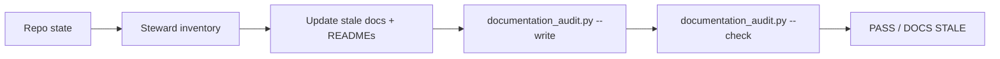
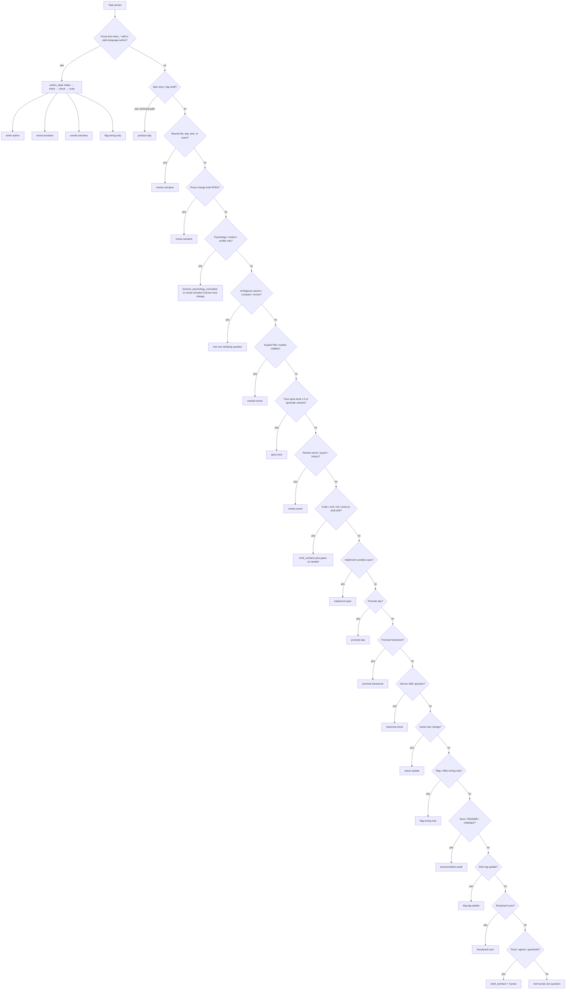

# Pipeline reference

Canonical routing logic lives in [`.agents/rules/orchestrator.md`](../../.agents/rules/orchestrator.md). This document is a **readable index** for humans; if anything conflicts, the orchestrator rule file wins.

**Skill catalogue (invoke by name):** [`SKILL_CATALOG.md`](SKILL_CATALOG.md) — skill → agent → pipeline → contract.

**Sandbox day path (MVP):** `narrative/draft/releases/<release>/non_prod_renpy_project/game/days/dayrdd_non_canon.rpy`

Stage helper: `py scripts/agent_next_step.py --list-pipelines` · `py scripts/agent_next_step.py --pipeline <name> --stage <n>`

**Entry points:**

| Lane | Load as system prompt |
|------|------------------------|
| Technical production | [`.agents/rules/orchestrator.md`](../../.agents/rules/orchestrator.md) |
| Prose-first authoring | [`.agents/rules/writers_desk.md`](../../.agents/rules/writers_desk.md) or any `writer_*` skill → [Writer's Desk](#writers-desk-writers_desk) |
| Documentation hygiene | [`.agents/rules/documentation_steward.md`](../../.agents/rules/documentation_steward.md) or [`documentation_audit`](../../.agents/skills/documentation_audit/SKILL.md) skill → [Documentation steward](#documentation-steward-documentation_steward) |

## Quick routing table

| If the human wants to… | Pipeline | First agent |
|------------------------|----------|-------------|
| Author in plain language (any `writer_*` skill) | routes via Desk → see [Writer's Desk](#writers-desk-writers_desk) | `writers_desk` |
| Draft a new day end-to-end (technical path) | `produce-day` | `writers_room` |
| New scene/day after Desk intake | `writer-author` | `writers_desk` (stage 1) → `writers_room` (stage 2) |
| Fix prose after code/review (`dayrdd_narrative_change_brief.md` OPEN) | `revise-narrative` | `writers_room` |
| Full rewrite of file, day, time period, or story chain event | `rewrite-narrative` | `writers_room` |
| Review existing scene (canon, psychology, history) | `review-scene` | three gates (parallel) |
| F95 / adult VN market viability (read-only) | `market-review` | `adult_market_reviewer` |
| Tune erotic intensity to level 1–5 or generate spice variants | `spice-tune` | `spiciness_tuning_agent` |
| Sandbox Ren'Py for an approved spec | `implement-spec` | `non_prod_code_agent` |
| Ship day to `renpy_project` | `promote-day` | `chief_architect` |
| Ship classes/screens framework | `promote-framework` | `chief_architect` |
| Narrow 1891 accuracy question | `historical-check` | `victorian_consultant` |
| Change locked canon | `canon-update` | `lead_narrative_editor` |
| Wire a new flag/effect only (Writer's Desk) | `flag-wiring-only` | `writers_desk` |
| Docs/catalogue/README hygiene | `documentation-audit` | `documentation_steward` — see [Documentation steward](#documentation-steward-documentation_steward) |
| Sync `story_board.md` after `.rpy` rewrites | `storyboard-sync` | `documentation_steward` |
| Add/refresh/recreate `.rpy` `[DAG_*]` comments | `dag-tag-update` | `non_prod_code_agent` (stage 1); `documentation_steward` confirms graph/storyboard drift (stage 2) |
| Code/architecture/lint review | — | `chief_architect` (no pipeline shortcut) |

Bare "assess prod", "compare prod to non-canon", or "review changes" without naming a lens → orchestrator asks **one** clarifying question (code/architecture, canon/narrative, psychology, market/spice, or prod-vs-draft drift).

## Writer's Desk (`writers_desk`)

Rule: [`.agents/rules/writers_desk.md`](../../.agents/rules/writers_desk.md) · Spec: [`docs/specs/writers-desk-agent-framework.md`](../specs/writers-desk-agent-framework.md)

The **prose-first front door** for a non-technical creative author. She speaks in scenes, characters, choices, and consequences; Desk translates that into existing machinery so she **never touches Ren'Py, Python, labels, setters, DAG tags, or asset manifests**.

Desk is a **concierge and router** — not a replacement for `writers_room`, code agents, gates, or the orchestrator. It does **not** write `dayrdd_non_canon.rpy` directly; it captures prose into an **Authoring Intent** and hands off to registered pipelines.


### Workflow: intake → intent → check → route

| Step | What Desk does |
|------|----------------|
| **1. Intake** | Interview in story terms only (who / where / when, what changes, what a choice *means*). Desk derives release, day, time period, and label scope. Default release: `release-1-mvp`. |
| **2. Authoring Intent** | Write `narrative/draft/releases/<release>/intents/dayrdd_authoring_intent.md` (+ `.json` per [`authoring_intent.schema.json`](../contracts/authoring_intent.schema.json)). Prose **verbatim**; flags (type + values); effects; branches; scale S/M/L. |
| **3. Contract pre-check** | Advisory only — scaled-down narrative, `historical_linter.py`, and psychology passes. Findings: **PASS**, **SUGGESTION** (with options), or **EXCEPTION** (logged; Writer self-signs after impact acknowledgement). Never blocks; binding gates remain authoritative. |
| **4. Route** | Hand Intent + scale to the pipeline in the routing table below. |

### Desk routing table

| Writer intent | Skill (loads Desk) | Pipeline after Desk |
|---------------|-------------------|---------------------|
| New scene / day | [`writer_write_scene`](../../.agents/skills/writer_write_scene/SKILL.md) | `writer-author` |
| Localized edit, single branch, flavour line | [`writer_rewrite_scene`](../../.agents/skills/writer_rewrite_scene/SKILL.md) | `revise-narrative` (workflow **B**) |
| Full rewrite of file / day / period / chain | [`writer_rewrite_scene`](../../.agents/skills/writer_rewrite_scene/SKILL.md) | `rewrite-narrative` (workflow **A**) |
| New choice / branch by meaning | [`writer_add_branch`](../../.agents/skills/writer_add_branch/SKILL.md) | via Intent → `revise-narrative` or `writer-author` |
| Stat consequence in emotional terms | [`writer_add_effect`](../../.agents/skills/writer_add_effect/SKILL.md) | via Intent → target pipeline |
| Track something new (bool default) | [`writer_add_flag`](../../.agents/skills/writer_add_flag/SKILL.md) | `flag-wiring-only` (batched class wiring) |
| Book1 manuscript prose | [`writer_write_book`](../../.agents/skills/writer_write_book/SKILL.md) | `book_writing_engine` skill |
| Pre-gate contract review | [`writer_contract_check`](../../.agents/skills/writer_contract_check/SKILL.md) | advisory only (no pipeline) |
| Log contract override | [`writer_log_exception`](../../.agents/skills/writer_log_exception/SKILL.md) | `exceptions/contract_exceptions.md` |
| What's left before ship? | [`writer_status`](../../.agents/skills/writer_status/SKILL.md) | advisory only |
| DAG / graph refresh | — | `dag-tag-update` |
| Asset gap | — | [`check_assets`](../../.agents/skills/check_assets/SKILL.md) skill |

Stage helper for new prose: `py scripts/agent_next_step.py --pipeline writer-author --stage 1 --day <dd>`.

### Artifacts Desk owns

| Artifact | Path |
|----------|------|
| Authoring Intent | `narrative/draft/releases/<release>/intents/dayrdd_authoring_intent.md` (+ `.json`) |
| Contract exceptions | `narrative/draft/releases/<release>/exceptions/contract_exceptions.md` (+ `.json`) |

Downstream agents produce promotion drafts, gate verdicts, and shaped `.rpy` — not Desk.

### Authority boundaries

| Desk may write | Desk never writes |
|----------------|-------------------|
| `intents/**`, `exceptions/**` | `dayrdd_non_canon.rpy`, `renpy_project/`, `docs/canon/` |
| `writer_*` skill **copy** only (when Writer asks for UX wording) | `classes*.rpy`, `scripts/**`, `.agents/rules/**` |

### Flag and stat protocols

- **Flags:** boolean by default; one-of-N → prompt Writer for allowed values, record whitelist in Intent, queue **`flag-wiring-only`** before gates/promotion (batched class wiring — usage in draft may precede setter existence).
- **Stats:** map to existing vocabulary (`insp`, `corr`, anxiety, per-character suspicion); new mechanics → escalate `chief_architect`.
- **Shaping** after gates (automatic, downstream): `non_prod_code_agent`, `dag-tag-update`, `check_assets`, [scene direction](#scene-direction-post-process) — see full list in [`writers_desk.md`](../../.agents/rules/writers_desk.md) § Shaping.

## Spice-tune vs market-review

These pipelines are often confused because both mention "spice". They are separate:

| Question | Pipeline | Agent | Writes files? |
|----------|----------|-------|---------------|
| Is the tone/tension/F95 positioning viable? Should we promote, cut, or defer? | `market-review` | `adult_market_reviewer` | **No** (read-only report) |
| Change content to level 1–5, make a passage hotter/milder, or generate level variants | `spice-tune` | `spiciness_tuning_agent` → `writers_room` (if prose changes) → gates | **Yes** (non-canon variants/briefs) |

- **Market "spice audit"** = assess whether erotic intensity fits adult-VN market expectations and promotion readiness. Recommendations only; route approved rewrites to `revise-narrative` or `spice-tune`.
- **Spice tune** = interactive dial along the 1–5 scale. Level **5** is project default (historical fidelity first). Level **1** is erotic-fantasy first with Victorian rules retrofitted afterward. See [`.agents/rules/spiciness_tuning_agent.md`](../../.agents/rules/spiciness_tuning_agent.md).

## Scene direction post-process

**Not a pipeline.** Deterministic sprite placement via `scripts/scene_direction.py` — agent rule [`.agents/rules/scene_direction_agent.md`](../../.agents/rules/scene_direction_agent.md), skill [`.agents/skills/scene_direction/SKILL.md`](../../.agents/skills/scene_direction/SKILL.md). Touches `[asset auto]` `show`/`hide` lines only; never dialogue or gated prose.

| When to run | After writers' room gates pass on prose-changing work, **before** `non_prod_code_agent` shapes/wraps the draft (if the file has staged scenes) |
|-------------|------------------------------------------------------------------------------------------------------------------------------------------------|
| Hooked from | `produce-day`, `rewrite-narrative`, `revise-narrative`, `writer-author`, and any other gated prose pass that may change on-screen cast |
| Skip | No staged scenes; diagnosis-only `spice-tune` (no prose rewrite); read-only pipelines (`market-review`, `review-scene`) |

```powershell
py scripts/scene_direction.py --files "<dayrdd_non_canon.rpy>"
py scripts/format_non_canon.py <same paths>
```

Stage tables below mark the hook as *post-gates* where it applies. It is **not** part of `spice-tune`'s spice logic — only a shared staging refresh after gated prose lands.

**Standalone trigger:** "refresh sprite staging", "run scene direction on day N" → load the [`scene_direction`](../../.agents/skills/scene_direction/SKILL.md) skill directly; do not route through `spice-tune` or other narrative pipelines.

## Documentation steward (`documentation_steward`)

Rule: [`.agents/rules/documentation_steward.md`](../../.agents/rules/documentation_steward.md)

**Operational documentation sync** — keeps README files, agent docs, feature specs, contracts, and the generated documentation catalogue aligned with the current repo. Not creative: no story prose, no canon edits, no production Ren'Py behavior changes.



### Pipelines steward owns or closes

| Pipeline | Steward role | Skill entry |
|----------|--------------|-------------|
| **`documentation-audit`** | Primary owner — full docs hygiene pass | [`documentation_audit`](../../.agents/skills/documentation_audit/SKILL.md) |
| **`storyboard-sync`** | Primary owner — update human planning doc from `.rpy` + graph evidence | [`storyboard_sync`](../../.agents/skills/storyboard_sync/SKILL.md) |
| **`dag-tag-update`** | Stage 2 — after `non_prod_code_agent` edits `[DAG_*]` tags, confirm graph manifest and storyboard references are fresh or report drift | — |

Standup `audit` queue items may also route here (read-only review or manifest/docs sync) via [`action_from_standup`](../../.agents/skills/action_from_standup/SKILL.md).

### Operating order (always this sequence)

| Step | Action |
|------|--------|
| **1** | Inventory current repo state — do not trust stale catalogue text |
| **2** | Update documentation **before** cataloguing (READMEs, specs, agent tables, broken links) |
| **3** | `py scripts/documentation_audit.py --write` |
| **4** | `py scripts/documentation_audit.py --check` |
| **5** | On commit/PR: `py scripts/validate.py --profile changed --agent documentation_steward --files "<changed>"` |

Stage helpers: `py scripts/agent_next_step.py --pipeline documentation-audit --stage 1` · `--pipeline storyboard-sync --stage 1` · `--pipeline dag-tag-update --stage 2`

### Artifacts steward maintains

| Artifact | Purpose |
|----------|---------|
| `docs/DOCUMENTATION_CATALOG.md` | Human-readable cross-project documentation index |
| `docs/DOCUMENTATION_AUDIT.md` | Audit findings and missing README coverage |
| `docs/documentation_catalog.json` | Machine-readable catalogue ([`documentation_catalog.schema.json`](../contracts/documentation_catalog.schema.json)) |
| `narrative/draft/releases/<release>/planning/story_board.md` | Human planning doc — **derived from** `.rpy` scripts, not graph source of truth |

**Storyboard direction of truth:** `.rpy` drafts (+ optional DAG tags) → graph manifest / audit reports → steward updates `story_board.md` where drift is found.

### Authority boundaries

| Steward may write | Steward never writes |
|-------------------|----------------------|
| `docs/**`, folder READMEs, `AGENTS.md`, `.agents/README.md`, skill doc copy | `dayrdd_non_canon.rpy` prose, `narrative/canon/**` lore |
| Generated catalogue/audit JSON + markdown | `renpy_project/` gameplay code |
| `story_board.md` planning documentation | `[DAG_*]` tags in `.rpy` (that is `non_prod_code_agent` stage 1 of `dag-tag-update`) |

Verdicts: `PASS` · `DOCS STALE` · `NEEDS HUMAN CONFIRMATION`. If a docs fix requires code behavior change first → escalate `chief_architect`.

## Classification flowchart



**Not pipelines:** Cursor skills such as `daily_standup` and `action_from_standup` resolve backlog items via [`docs/backlog/task_registry.json`](../../docs/backlog/task_registry.json); they chain into the pipelines above when execution starts.

## Pipelines

### `produce-day`

| Trigger | "Produce day N", "Write day N", "Draft day N" (technical path) |
|---------|------------------------------------------------------------------|
| **1** | `writers_room` — divergent → convergent → **three gates sequential** (lead editor → forensic psych → Victorian) |
| *post-gates* | [Scene direction post-process](#scene-direction-post-process) (if staged scenes) |
| **2** | `non_prod_code_agent` — technical wrap; creative prose **verbatim** |
| **3** | `chief_architect` — sandbox code validation |
| **4** | Deliver to human |

Gates run **inside** stage 1 only. Narrative gap at stage 2 → file `dayrdd_narrative_change_brief.md` → `revise-narrative`.

### `writer-author`

Desk-owned pipeline for **new** prose. Full Desk workflow: [Writer's Desk § Workflow](#workflow-intake--intent--check--route).

| Trigger | After Desk intake: new scene/day from [`writer_write_scene`](../../.agents/skills/writer_write_scene/SKILL.md) |
|---------|---------------------------------------------------------------------------------------------------------------|
| **1** | `writers_desk` — intake → Authoring Intent → advisory contract pre-check |
| **2** | `writers_room` — convergent + gates on captured prose (scale S/M/L per intent) |
| *post-gates* | [Scene direction post-process](#scene-direction-post-process) (if staged scenes) |
| **3** | `non_prod_code_agent` — shape verbatim prose + tags; DAG/asset sync |
| **4** | `chief_architect` — sandbox code validation |

### `flag-wiring-only`

Desk-owned pipeline for **state wiring only** (no prose change). See Desk [flag protocol](#flag-and-stat-protocols).

| Trigger | [`writer_add_flag`](../../.agents/skills/writer_add_flag/SKILL.md) / [`writer_add_effect`](../../.agents/skills/writer_add_effect/SKILL.md) after Intent captures the request |
|---------|-------------------------------------------------------------------------------------------------------------------------------------------------------------------------------|
| **1** | `writers_desk` — capture flag/effect in plain language (boolean default; prompt for allowed values if one-of-N) |
| **2** | `non_prod_code_agent` — wire attribute/whitelist/setter into `classes_non_canon.rpy` + notes |
| **3** | `chief_architect` — framework mockup review; queue for `promote-framework` when ready |

### `review-scene`

| Trigger | "Review [scene/day]", canon/psychology/history check (not market tuning) |
|---------|--------------------------------------------------------------------------|
| **1** | `lead_narrative_editor`, `forensic_psychology_consultant`, `victorian_consultant` **in parallel** |
| **2** | Orchestrator consolidates → human decides |

Gate order on **new promotion drafts** is always sequential inside `writers_room`; `review-scene` is the parallel read-only pass on existing content.

### `market-review`

| Trigger | Explicit F95, adult VN market, tone/tension viability, prod-vs-draft **market** comparison, deep-dive market language |
|---------|-----------------------------------------------------------------------------------------------------------------------|
| **1** | `adult_market_reviewer` (read-only) |
| **2** | Report to human |

**Do not route** bare "assess prod", "assess draft", "compare prod to non-canon", or "review changes" here without a lens. Ask one follow-up first.

Modes: `assess-prod`, `assess-draft`, `compare-prod-draft`, `deep-dive`.

**Authority:** read-only. May recommend rewrite, cut, defer, or promotion status. Approved prose changes route to `revise-narrative` or `spice-tune` — not inline edits by the reviewer.

### `spice-tune`

| Trigger | "Spice dial", "tune to level N", hotter/milder, "all 5 levels", level 1/2/3/4/5 variant |
|---------|-----------------------------------------------------------------------------------------|
| **1** | `spiciness_tuning_agent` — diagnosis, rewrite brief, or variant plan |
| **2** | `writers_room` — **only when prose must change** |
| **3–5** | Three gates **sequential** on the selected variant |

Diagnosis-only (stage 1, no prose rewrite) ends here. When stages 2–5 ran and cast may have changed → [scene direction post-process](#scene-direction-post-process) before any code handoff.

**Variant rule:** multiple levels or "all 5" stay in `narrative/pipeline/experiments/` until the human picks one. Do not merge several levels into `dayrdd_non_canon.rpy`.

**Authority:** may propose non-canon variants and briefs. Does not edit production, canon, or bypass gate order.

### `implement-spec`

| Trigger | "Implement spec X", sandbox draft code for an approved spec |
|---------|-------------------------------------------------------------|
| **1** | `non_prod_code_agent` |
| **2** | `chief_architect` |
| **3** | Deliver sandbox files (no production changes) |

If blocked on prose → `revise-narrative` first, then resume.

### `promote-day`

| Trigger | "Promote day N" |
|---------|-----------------|
| **1** | `chief_architect` — pre-promotion validation |
| **2** | `forensic_psychology_consultant` — pre-prod psychology |
| **3** | `prod_code_agent` — copy to `renpy_project/game/dayrdd.rpy` (verbatim creative content) |
| **4** | `forensic_psychology_consultant` — post-prod psychology |
| **5** | `chief_architect` — lint / structure |
| **6** | Deliver |

### `promote-framework`

| Trigger | "Promote classes", framework to prod |
|---------|-------------------------------------|
| **1** | `chief_architect` |
| **2** | `prod_code_agent` |
| **3** | `chief_architect` |
| **4** | Deliver |

### `historical-check`

| Trigger | Narrow 1891 accuracy question |
|---------|------------------------------|
| **1** | `victorian_consultant` → human |

No downstream stages.

### `revise-narrative`

| Trigger | `dayrdd_narrative_change_brief.md` with `Status: OPEN`; code/editor-driven prose repair; or Desk routes localized edit via [`writer_rewrite_scene`](../../.agents/skills/writer_rewrite_scene/SKILL.md) |
|---------|----------------------------------------------------------------------------------------------------------------------------------------------------------------------------------------------------------|

**Prerequisite:** change brief with scale **S / M / L**, **or** Desk Authoring Intent for prose-first localized edits.

| Stage | Agent |
|-------|-------|
| **1** | `writers_room` — scale **S** → workflow **B**; **M** → partial divergent pool; **L** → workflow **A** |
| **2–4** | Three gates sequential |
| **5** | Close brief (`Status: CLOSED`) |
| *post-gates* | [Scene direction post-process](#scene-direction-post-process) for touched scenes (if staged) |
| **6** | Resume requester (usually `non_prod_code_agent`) |

**Chaining:** if `implement-spec` or `promote-*` hit a narrative gap, run `revise-narrative` before resuming. Code agents must not patch prose inline.

### `rewrite-narrative`

| Trigger | Rewrite file, day, time period, or story chain event; or Desk routes full rewrite via [`writer_rewrite_scene`](../../.agents/skills/writer_rewrite_scene/SKILL.md) |
|---------|----------------------------------------------------------------------------------------------------------------------------------------------------------------|
| **1** | `writers_room` — workflow **A** (full divergent pool → convergent → three gates sequential) |
| *post-gates* | [Scene direction post-process](#scene-direction-post-process) (if staged scenes) |
| **2** | `non_prod_code_agent` — technical wrap; verbatim prose |
| **3** | `chief_architect` — sandbox code validation |
| **4** | Deliver to human |

### `canon-update`

| Trigger | Change locked canon |
|---------|---------------------|
| **1–3** | Lead editor, forensic psych, Victorian — impact analysis |
| **4** | **Hard human stop** |
| **5** | Authorized edit only |

### `documentation-audit`

Steward-owned pipeline. Full workflow: [Documentation steward § Operating order](#operating-order-always-this-sequence).

| Trigger | "Documentation audit", stale READMEs, sync specs, refresh catalogue, weekly docs hygiene, pre-PR docs pass |
|---------|-------------------------------------------------------------------------------------------------------------|
| **1** | `documentation_steward` — inventory → fix stale docs → `--write` → `--check` |

### `dag-tag-update`

| Trigger | Add, refresh, recreate, audit, or repair `.rpy` `[DAG_*]` comments |
|---------|---------------------------------------------------------------------|
| **1** | `non_prod_code_agent` — update only `[DAG_*]` comments; preserve `[DAG_* ... manual]` unless explicitly told to overwrite |
| **2** | `documentation_steward` — confirm graph manifest / storyboard references are refreshed or report drift — see [steward pipelines table](#pipelines-steward-owns-or-closes) |

Any DAG tag update triggers graph manifest regeneration and storyboard drift audit.

### `storyboard-sync`

Steward-owned pipeline. Direction of truth: [Documentation steward § Artifacts](#artifacts-steward-maintains).

| Trigger | Manual `.rpy` rewrite, structural agent rewrite, or graph audit reports storyboard drift |
|---------|------------------------------------------------------------------------------------------|
| **1** | `documentation_steward` — update `story_board.md` from current `.rpy` scripts and graph audit evidence; never invent labels absent from scripts |

## Writers' room internal workflows

See [`.agents/rules/writers_room.md`](../../.agents/rules/writers_room.md):

| Letter | Use |
|--------|-----|
| **A** | Full new day or full rewrite (divergent pool → convergent → gates) |
| **B** | Convergent-only revision |
| **D–E2** | Narrative change brief scales S/M/L |

Sub-agent index: [`.agents/rules/writers_room/README.md`](../../.agents/rules/writers_room/README.md).

Prose-first authoring always starts at [Writer's Desk](#writers-desk-writers_desk) — not here.

Documentation hygiene always starts at [Documentation steward](#documentation-steward-documentation_steward) — not the orchestrator.

## Validation after pipeline work

| When | Command |
|------|---------|
| WIP draft (no gates yet) | `py scripts/validate.py --profile changed --agent writers_room --skip-gate-checks --files "<dayrdd_non_canon.rpy>"` |
| Default / CI | `py scripts/validate.py --profile changed --agent human --files "<paths>"` |
| Pre-promotion | `py scripts/validate.py --profile changed --agent human --strict-gates --files "<dayrdd_non_canon.rpy>"` |
| Documentation / catalogue edits | `py scripts/validate.py --profile changed --agent documentation_steward --files "<paths>"` |
| Pre-PR bundle | `py scripts/orchestrate_review.py --files "<paths>"` |
| Contract sidecars | `py scripts/contract_validate.py --day day105 --release release-1-mvp` |
| Docs catalogue refresh | `py scripts/documentation_audit.py --write` then `--check` |
| Next agent hint | `py scripts/agent_next_step.py --pipeline produce-day --stage 2` |

Gate policy: if **any** of the three `dayrdd_gate_*.md` files exist for a day, CI requires **all three** with valid `## Verdict` sections. See [`CONTRACTS.md`](CONTRACTS.md).
