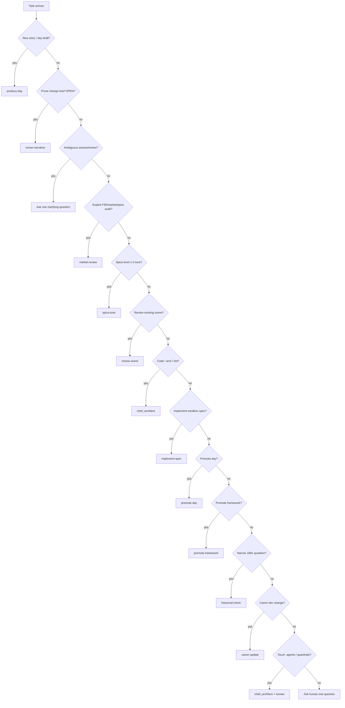

# Pipeline reference

Canonical routing logic lives in [`.agents/rules/orchestrator.md`](../../.agents/rules/orchestrator.md). This document is a **readable index** for humans; if anything conflicts, the orchestrator rule file wins.

## Classification flowchart

## Pipelines

### `produce-day`

| Trigger | "Produce day N", "Write day N", "Draft day N" |
|---------|-----------------------------------------------|
| **1** | `writers_room` — divergent → convergent → **three gates** (sequential) |
| **2** | `non_prod_code_agent` — technical wrap, **verbatim** prose |
| **3** | `chief_architect` — sandbox code validation |
| **4** | Deliver to human |

Gates run **inside** stage 1 only. Do not re-run gates as separate orchestrator stages unless stage 1 failed mid-pipeline and human requests a gate-only retry.

### `review-scene`

| Trigger | "Review [scene/day]", canon/history check (not market) |
|---------|------------------------------------------------------|
| **1** | `lead_narrative_editor`, `forensic_psychology_consultant`, `victorian_consultant` **in parallel** |
| **2** | Orchestrator consolidates → human decides |

### `market-review`

| Trigger | Explicit F95, market, spice audit, deep-dive market language |
|---------|--------------------------------------------------------------|
| **1** | `adult_market_reviewer` (read-only) |
| **2** | Report to human |

Modes: `assess-prod`, `assess-draft`, `compare-prod-draft`, `deep-dive`.

### `spice-tune`

| Trigger | Spice dial, level N, hotter/milder, all 5 variants |
|---------|---------------------------------------------------|
| **1** | `spiciness_tuning_agent` |
| **2** | `writers_room` if prose must change |
| **3–5** | Three gates (sequential) on selected variant |

Multi-level outputs stay in `narrative/pipeline/experiments/` until human picks one.

### `implement-spec`

| Trigger | "Implement spec X", sandbox draft code |
|---------|--------------------------------------|
| **1** | `non_prod_code_agent` |
| **2** | `chief_architect` |

If blocked on prose → `revise-narrative` first.

### `promote-day`

| Trigger | "Promote day N" |
|---------|-----------------|
| **1** | `chief_architect` — pre-promotion validation |
| **2** | `forensic_psychology_consultant` — pre-prod psychology |
| **3** | `prod_code_agent` — copy to `renpy_project/game/dayrdd.rpy` |
| **4** | `forensic_psychology_consultant` — post-prod psychology |
| **5** | `chief_architect` — lint / structure |
| **6** | Deliver |

### `promote-framework`

| Trigger | "Promote classes", framework to prod |
|---------|-------------------------------------|
| **1** | `chief_architect` |
| **2** | `prod_code_agent` |
| **3** | `chief_architect` |

### `historical-check`

| Trigger | Narrow 1891 accuracy question |
|---------|------------------------------|
| **1** | `victorian_consultant` → human |

### `revise-narrative`

| Trigger | `dayrdd_narrative_change_brief.md` with `Status: OPEN`, or explicit prose repair |
|---------|----------------------------------------------------------------------------------|
| **1** | `writers_room` (scale S/M/L → workflows B, partial pool, or A) |
| **2–4** | Three gates sequential |
| **5** | Close brief |
| **6** | Resume requester (usually `non_prod_code_agent`) |

### `canon-update`

| Trigger | Change locked canon |
|---------|---------------------|
| **1–3** | Lead editor, forensic psych, Victorian — impact analysis |
| **4** | **Hard human stop** |
| **5** | Authorized edit only |

## Writers' room internal workflows

See [`.agents/rules/writers_room.md`](../../.agents/rules/writers_room.md):

| Letter | Use |
|--------|-----|
| **A** | Full new day (divergent pool → convergent → gates) |
| **B** | Convergent-only revision |
| **D–E2** | Narrative change brief scales S/M/L |

Sub-agent index: [`.agents/rules/writers_room/README.md`](../../.agents/rules/writers_room/README.md).

## Validation after pipeline work

| When | Command |
|------|---------|
| WIP draft (no gates yet) | `py scripts/validate.py --skip-gate-checks --files "<dayrdd_non_canon.rpy>"` |
| Default / CI | `py scripts/validate.py --files "<paths>"` |
| Pre-promotion | `py scripts/validate.py --strict-gates --files "<dayrdd_non_canon.rpy>"` |
| Pre-PR bundle | `py scripts/orchestrate_review.py --files "<paths>"` |
| Next agent hint | `py scripts/agent_next_step.py --pipeline produce-day --stage 2` |

Gate policy: if **any** of the three `dayrdd_gate_*.md` files exist for a day, CI requires **all three** with valid `## Verdict` sections. See [`CONTRACTS.md`](CONTRACTS.md).
