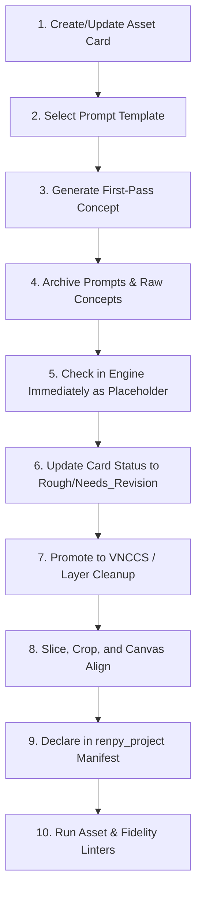

# Art Sprint Production Workflow Manual

This document details the day-to-day, step-by-step production loop for generating, slicing, validating, and deploying visual assets during active development sprints.

---

## 🔄 The 10-Step Active Production Loop

Whenever a new sprite, background, or UI asset is required, execute this exact workflow:



### 1. Create/Update Asset Card
Define a tracking card under `assets_source/character_cards/` or `assets_source/location_cards/` conforming to the schemas in `docs/art/ASSET_CARD_SCHEMA.md`.

### 2. Select Prompt Template
Pull the appropriate template pattern from `docs/art/PROMPT_LIBRARY.md` matching your target character or environment.

### 3. Generate First-Pass Concept
Generate concepts using Midjourney, Gemini, or VNCCS, applying the core visual anchors defined in `docs/art/STYLE_BIBLE.md`.

### 4. Archive Prompts & Raw Concepts
Save all generation prompts and raw, unmasked image outputs inside `assets_source/prompts/` and `assets_source/generated_concepts/`.

### 5. Check in Engine Immediately
Drop the raw, rough concept into `renpy_project/game/images/` to immediately fill the manifest gap and keep gameplay scripts playable, even before pixel cleanup is performed.

### 6. Update Card Status
Mark the asset card's `status` field to `rough` or `needs_revision`.

### 7. Promote to VNCCS / Layer Cleanup
Once a concept is conceptually approved, promote it for final grid slicing (sprites) or background mask layering (Savoy overlays).

### 8. Slice, Crop, and Canvas Align
Execute alpha background removal and canvas coordinates alignment matching the rules in `docs/art/VNCCS_SPRITE_SHEETS.md`. Export the clean asset as a desaturated, compressed `.webp` to `assets_source/approved_assets/`.

### 9. Declare in the Manifest
If the asset represents a new key alias, declare its file path mapping inside `renpy_project/game/assets_manifest.rpy`.

### 10. Run Asset & Fidelity Linters
Execute the project's automated verification tools to verify manifest synchronization and block visual continuity contradictions:
```powershell
python scripts/validate_art_fidelity.py
python scripts/check_assets.py
```

---

## 🏆 MVP Sprint Priorities

To deliver the game successfully within rapid developmental sprints, follow these strict execution rules:

*   **Rough Art in-Engine Beats Polished Art in Folders**: A rough solid-color fallback or sketchy raw generation that is correctly wired into Ren'Py is infinitely better than a flawless, fully rendered painting that sits detached in an artist's personal folder. Wire assets up immediately!
*   **Polish High-Frequency Assets First**: Focus high-fidelity manual painting, edge anti-aliasing, and detailed lighting overlays exclusively on assets appearing repeatedly across scripts (e.g. Cora, Gideon, servants' corridor). Minor props or once-off scenes should use basic sandboxed generation fallbacks.
*   **Generate Generously, Ship Selectively**: Render multiple visual variations at the concept phase, but aggressively cut weak, off-model, or blurry assets before they reach production review.
*   **Do Not Overbuild**: Focus exclusively on delivering the MVP visuals. Do **not** attempt to write layered paper-doll runtime code, complex dynamic lighting logic, or redundant DAM (Digital Asset Management) databases. Simple files, strict schemas, and clean scripts are all that is required.
