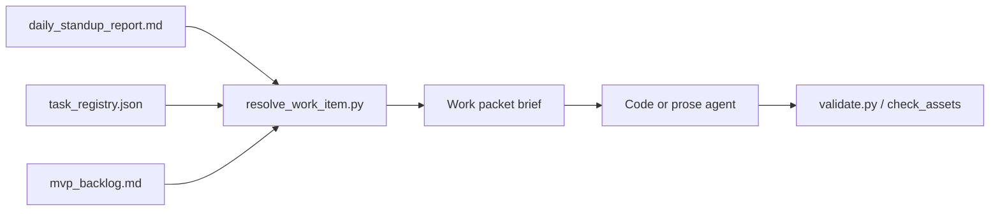

# Backlog & standup work routing

## Files

| File | Purpose |
|------|---------|
| [`mvp_backlog.md`](mvp_backlog.md) | Human-readable task definitions (N-* narrative, C-* coding) |
| [`task_registry.json`](task_registry.json) | Machine routing: specs, agents, skills, verify commands |

## Agent flow

1. Standup runs daily (`py scripts/daily_standup.py --report`).
2. Agent reads `planning/daily_standup_report.md`.
3. Agent runs `py scripts/resolve_work_item.py --from-standup --next`.
4. Agent loads rule + skill from packet, reads specs, executes, verifies.

Skill: [`.agents/skills/action_from_standup/SKILL.md`](../../.agents/skills/action_from_standup/SKILL.md)

## Adding a new task

1. Add section to `mvp_backlog.md` with id, description, files, verify command.
2. Add matching entry to `task_registry.json` under `tasks`.
3. Regenerate standup so the item appears in the work queue.
