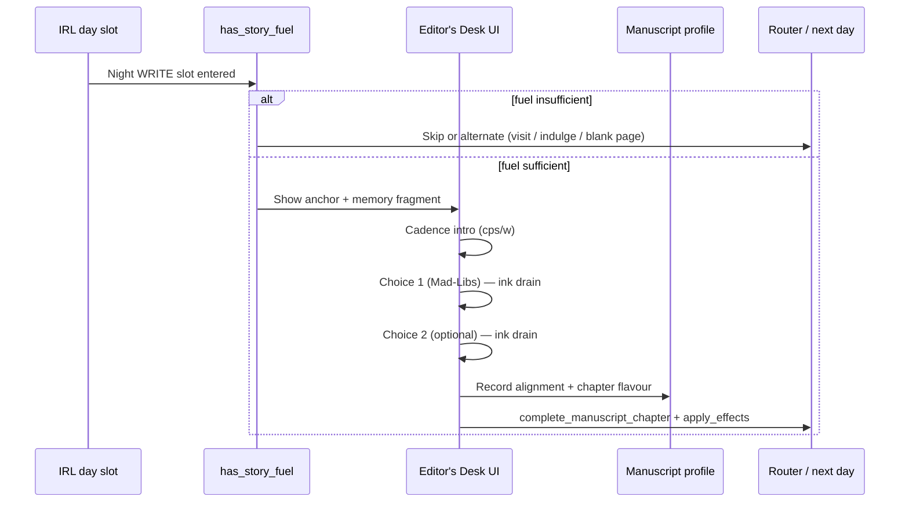

# Backlog: The Editor's Desk (Interactive Writing Slots)

**Status:** Spec draft — awaiting human approval before implementation  
**Owners:** Chief Architect (systems/UI), Lead Narrative Editor (canon/voice), Writers' Room (beat copy)  
**Related:** `docs/game_mechanics_bible.md` §III (deferred agency dials), `story_board.md` WRITE slots, runtime `day101_4_write_the_chapter` / `day102_4_cora_writes_a_chapter`

---

## 1. Summary

**The Editor's Desk** replaces passive night-writing prose blocks with an interactive manuscript-drafting beat. The player composes Cora's illicit chapter from fragments of the **same linear IRL day** they just played, using:

1. **Recycled visuals** — extreme crops/filters of daytime assets (Kuleshov recontextualization), not new CGs per branch.
2. **Inline flavour choices** — Mad-Libs-style sentence completion inside Cora's voice, not a detached stat menu.
3. **A dedicated writing UI** — parchment overlay, torn-memory fragment, inkwell drain, variable text cadence.
4. **Silent profiling** — cumulative manuscript alignment that later informs IRL dialogue flavour and `story.cora_release1_flavour` (without branching the physical timeline in Days 1–2).

**Design intent from conversation:** compensate for limited IRL agency with high agency on the page; ~90% visual reuse; text does the expensive narrative work.

---

## 2. Problem & goals

| Problem | Goal |
|--------|------|
| IRL spine is linear; choices mostly change stats/flags and flavour lines | Give **felt ownership** of the story Cora is writing |
| Full branch CGs per night choice are unaffordable for MVP | **≤1 anchor scene + 1 crop per chapter**; no new full-scene art per menu option |
| Current WRITE beats are readable but not interactive (`day101_4_write_the_chapter`) | Make writing a **repeatable mini-game** with clear inputs/outputs |
| `game_mechanics_bible.md` defers Influence/Submission dials | Harvest alignment **inside the manuscript layer first**; surface in IRL from Day 3+ only |

**Non-goals (MVP):**

- Branching the IRL timeline based on manuscript choices (Days 1–2).
- NVL-mode rewrite of the whole game.
- New full CGs per manuscript flavour.
- Replacing `has_story_fuel()` gates or deadline checks (`manuscript_progress`, `game_over_deadline_*`).

---

## 3. Design principles

1. **IRL is capture; night is authorship.** Daytime events are "what happened." The writing slot is "how Cora sensationalizes it."
2. **The 90% rule.** One anchor: `bg_cora_desk_night`. One memory fragment per chapter: cropped/filtered reuse of a daytime image. Menu options change **text only** (plus hidden state).
3. **Extreme crops only.** Never show the full daytime composition at night. Sepia, blur, vignette, torn-paper mask — fragment implies context.
4. **Widening gap (Days 1–3).** Submissive maid by day vs. whatever she writes at night. Do not collapse that tension with immediate IRL consequences.
5. **Spine-safe.** WRITE slots still call `resolve_turn()` / `end_slot(outcome=…)` per `story_board.md`; gates unchanged unless explicitly revised in canon.
6. **State discipline.** No ad hoc `default pure_fear = 0` in episodic files. Profiling lives on `StoryState` with whitelisted setters (Chief Architect contract).
7. **Separate desk modules.** Interactive drafting lives in dedicated `desk[rdd].rpy` files, not inlined in `day[rdd].rpy`. Day files keep gates, routing, and post-write bookkeeping only.

---

## 4. Player experience (one chapter)



**Feel targets:**

- Urgent pen: fast bursts, pauses on `{w=…}`, slower dread lines.
- Limited ink: inkwell steps down per choice (psychological urgency, not a hard fail timer).
- Player is **co-author** of one or two sentences, not picking abstract pillars from a list.

---

## 5. Visual & UI spec — `editors_desk_ui`

### 5.1 Layer stack

| Layer | Asset / element | Notes |
|-------|-----------------|-------|
| 0 | `bg_cora_desk_night` | Full scene; standard `scene` — not inside screen |
| 1 | `gui/manuscript_page.png` (or equivalent) | Parchment sheet, center-right; hides default say window during beat |
| 2 | Memory fragment | `AlphaMask(crop_image, "gui/torn_edges_mask.png")`; left of text column |
| 3 | Inkwell | `gui/inkwell_full.png` → `_half` → `_dregs`; align near desk (reuse HUD ink motif if art exists) |
| 4 | Text | Say mode **or** screen `text` block; must support `{cps}` / `{w}` |

### 5.2 Screen contract (proposed)

```python
# screens.rpy — requires human approval to merge
screen editors_desk_ui(crop_image, ink_level=100):
    zorder 100
    tag menu
    # hide stats_overlay optional — TBD
    add "gui/manuscript_page.png" align (0.5, 0.5)
    add AlphaMask(crop_image, "gui/torn_edges_mask.png") xalign 0.15 yalign 0.4
    # inkwell tier from ink_level thresholds: 75 / 40 / 10
```

**Session variable:** `manuscript_ink` (ephemeral int 100→10 per chapter; reset at beat start; **not** persisted in save unless design requests it).

### 5.3 Asset manifest requirements

Each promoted chapter must declare in `assets_manifest.rpy`:

- Crop images per IRL hook (e.g. `cg_day101_corridor_crop_grip`, `cg_day102_tea_crop_cup`).
- GUI: `manuscript_page`, `torn_edges_mask`, inkwell tiers (or fallback Solid + lint note).

**Production rule:** crops are **derived in art pipeline** from existing daytime stills (close-up export), not new illustrations.

### 5.4 Mode transition

Entering the Desk:

1. `scene bg_cora_desk_night`
2. Short bridge line in normal say mode.
3. `show screen editors_desk_ui(...)` + `window hide` (or custom text viewport).
4. Run drafting beats.
5. `hide screen editors_desk_ui` + restore say window + outro line.

---

## 6. Mechanical spec

### 6.1 Existing systems (unchanged unless noted)

| Mechanism | Current behavior | Editor's Desk relationship |
|-----------|------------------|----------------------------|
| `has_story_fuel(n)` | `(inspiration + corruption_xp) >= n` | Still gates **whether** drafting runs |
| `apply_effects` on write | e.g. Ch1: `insp=-10` | Still runs **after** chapter completes |
| `story.complete_manuscript_chapter(id)` | Adds to `completed_chapters`, bumps `manuscript_progress` | Still the completion signal |
| `story.day1_corridor_state` etc. | IRL branch strings | Select **which crop + setup paragraph**, not new IRL branches |
| `story.day1_ledger_focus` / `day2_chore_focus` | Reflection focus | Modulates **secondary flavour lines** inside same alignment choice (as today) |
| WRITE slot router | `d1_write_ch1`, `d2_write_night`, … | Outcomes unchanged |

### 6.2 New state — manuscript profiling (proposed)

**Option A (recommended):** three capped counters on `StoryState`, setter-only increments:

| Field | Type | Meaning |
|-------|------|---------|
| `manuscript_dread` | int 0–N | Fear / gothic victim / clinical horror |
| `manuscript_submission` | int 0–N | Shameful surrender, heat, obedience |
| `manuscript_control` | int 0–N | Calculation, blackmail, puppet-master |

Methods: `story.add_manuscript_alignment("dread"|"submission"|"control", amount=1)` with cap (e.g. 12).

**Per-chapter flavour string** (whitelist):

| Field | Example values |
|-------|----------------|
| `day1_manuscript_flavour` | `"dread"`, `"submission"`, `"control"` |
| `day2_manuscript_flavour` | same |

Set via `story.set_day1_manuscript_flavour(value)` — **one string per day**, last choice wins if multiple beats (or store primary pillar only).

**Mapping to existing release flavour (Day 5):**

| Dominant manuscript profile (Days 1–4) | Suggested bias for `cora_release1_flavour` |
|----------------------------------------|---------------------------------------------|
| `submission` highest | `"prey"` |
| `control` highest | `"predator"` |
| `dread` highest | `"observer"` |
| tied / ghost-like IRL + low counts | `"ghost"` |

Day 5 confession scenes **retain** explicit `set_cora_release1_flavour` menus; profiling only **biases default copy** or optional `[Manuscript tone]` hints — not a silent override without writer approval.

**Option B (lighter MVP):** only store `dayN_manuscript_flavour` string per night; no counters until Day 3 payoff. Counters preferred for Gemini "silent market research" goal.

### 6.3 Choice structure per chapter

| Step | Content |
|------|---------|
| Setup | 2–4 lines + fragment image keyed to IRL state |
| Stem | Incomplete manuscript sentence in quotes (Victorian, third-person maid-as-protagonist) |
| Menu | 3 options completing the stem (dread / submission / control) |
| Payoff line | Completed sentence + 1–2 lines Cora meta-commentary |
| Optional second stem | D2+ chapters; drains ink to dregs |
| Close | Hide UI, `complete_manuscript_chapter`, stat spend, router |

**Menu copy rules:**

- Options are **in-fiction prose fragments**, not `[Submission]` labels (bracket rule: decorative labels need `[[Word]]` if shown).
- No unescaped `[CamelCase]` in captions.

### 6.4 Text cadence contract

Writers deliver stems with tags; engineering provides a helper optional:

```python
# functions.rpy — optional
def cadence(slow_cps=20, fast_cps=55, pause=0.3, slow_text="", fast_text=""):
    return "{cps=%d}%s{/cps}{w=%s} {cps=%d}%s{/cps}" % (slow_cps, slow_text, pause, fast_cps, fast_text)
```

**Minimum:** at least one tagged burst and one `{w=…}` pause per chapter.

### 6.5 Inkwell mechanic

| Event | `manuscript_ink` |
|-------|------------------|
| Chapter start | 100 |
| After choice 1 | 50 |
| After choice 2 (if present) | 10 |
| Closing line | 0 (dregs visual) |

Cosmetic only for MVP — does not block choices.

---

## 7. Content contract — Days 1 & 2 (reference mock)

These tables are **intent for Writers' Room**; final copy must pass voice guides and `story_board.md` stat rules.

### 7.1 Day 101 — Chapter 1 (`day101_4_write_the_chapter`)

**Entry:** `has_story_fuel(15)`; `story.set_day1_night_action("write")`.

| `day1_corridor_state` | Memory fragment | Setup hook |
|----------------------|-----------------|------------|
| `prey` | Crop: Gideon hand on jaw | Saw through door; exposed watcher |
| `predator` | Crop: Missy at keyhole / door edge | Used Missy as shield |
| `ghost` | Blurred corridor / sound-only | Wet slap, gasp, no sight |

**Stem (example):**

> "Lord G— pinned the helpless maid against the mahogany. His grip admitted no flight. As he leaned in, the maid…"

| Choice | Alignment | `day1_manuscript_flavour` |
|--------|-----------|---------------------------|
| …whimpered, paralyzed by surrender she hated needing. | submission | `submission` |
| …catalogued his weakness with cold eyes. | control | `control` |
| …shuddered with dread that felt older than the house. | dread | `dread` |

**Ledger modifier:** if `day1_ledger_focus == "corruption"`, append 1 corruption-flavoured clause to payoff (no extra menu).

**Complete:** `day1_chapter`, `apply_effects(susp=0, insp=-10, corr=0)`, `end_slot` / jump Day 102 morning per current runtime.

### 7.2 Day 102 — Chapter 1 catch-up or Chapter 2 (`day102_4_cora_writes_a_chapter`)

**Gates:** Ch1 if `manuscript_progress == 0` and fuel ≥ 15; Ch2 if progress ≥ 1 and fuel ≥ 30 (per storyboard).

| Condition | Fragment | IRL hook |
|-----------|----------|----------|
| Ch1 catch-up | Same as D1 table | `day1_corridor_state` |
| Ch2 | Crop: spilled teacup / fist on velvet | `day2_tea_choice` (`prey` / `predator` / `ghost`) |

**Ch2 stem (example):**

> "The Master of the House stood over her. Her insolence required a permanent…"

| Choice | Alignment |
|--------|-----------|
| …chastisement that would mark her skin. | submission |
| …partnership forged to bleed the estate. | control |
| …exile into the fog-choked street. | dread |

**Optional feedback (D2 only):** if `manuscript_submission >= 2` (etc.), one Cora self-audit line before sleep — mirrors Gemini mock; must match voice guide (no modern idiom).

---

## 8. IRL payoff schedule (deferred layers)

| Phase | When | Behavior |
|-------|------|----------|
| **MVP-A** | D101–D102 WRITE | Profiling stored; **no** IRL dialogue changes |
| **MVP-B** | D103+ | Gideon/Vance/Stern lines pick variant **within same label** via `if manuscript_*` thresholds |
| **MVP-C** | D105 | Profile informs confession **default** and `day5_dynamic` colour; merges with explicit motivation choice |

**Explicit constraint from design conversation:** Do not branch IRL scenes in Days 1–2 based on manuscript profile.

---

## 9. File layout (dedicated `.rpy` modules)

Desk sessions live in **their own runtime files**, parallel to day episodes, so writers and engineers can iterate on manuscript beats without scrolling through IRL spine logic.

### 9.1 Filename contract (extension)

| Layer | Pattern | Example |
|-------|---------|---------|
| Writers' Room draft | `desk[rdd]_non_canon.rpy` | `narrative/draft/releases/release-1-mvp/desk101_non_canon.rpy` |
| Runtime (promoted) | `desk[rdd].rpy` | `renpy_project/game/desk101.rpy` |

- `r` = release (`1` for MVP), `dd` = day slot (`01`–`05`), same indexing as `day101.rpy`.
- This is an **approved exception** to the default “all episodic content in `dayrdd.rpy`” rule, scoped to WRITE-slot drafting only.
- Shared infrastructure remains centralized: `screens.rpy` (`editors_desk_ui`), `functions.rpy` (helpers), `classes.rpy` (state API), `assets_manifest.rpy`.

**Optional later:** `desk_shared.rpy` for cross-day outro lines or reckoning-only UI if duplication appears; prefer per-day files first.

### 9.2 Responsibility split

| Concern | `day[rdd].rpy` (spine) | `desk[rdd].rpy` (drafting) |
|---------|------------------------|----------------------------|
| `has_story_fuel()` / deadlines | ✓ | — |
| `story.set_dayN_night_action(...)` | ✓ | — |
| Visit Missy / indulge / skip write | ✓ | — |
| `call` / `jump` into desk | ✓ (`call desk101_ch1`) | entry labels |
| `editors_desk_ui`, crops, stems, menus | — | ✓ |
| `manuscript_ink`, cadence text, alignment increments | — | ✓ |
| `story.set_dayN_manuscript_flavour(...)` | — | ✓ |
| `apply_effects`, `complete_manuscript_chapter` | ✓ (after `call` returns) | — |
| `resolve_turn()` / `end_slot(outcome=…)` | ✓ | — |

Day WRITE labels become **thin wrappers** (~5–15 lines): gate → `call` desk → apply storyboard stat/chapter contract → router.

### 9.3 Label naming (inside desk files)

Desk labels use the same spine prefix as the WRITE slot they serve:

| Desk label | Called from |
|------------|-------------|
| `day101_4_desk_ch1` | `day101_4_write_the_chapter` |
| `day102_4_desk_ch1_catchup` | `day102_4_cora_writes_a_chapter` (when `manuscript_progress == 0`) |
| `day102_4_desk_ch2` | `day102_4_cora_writes_a_chapter` (Ch2 path) |
| `day103_3_desk_ch3` | `day103_3_bedroom_final_write` |
| `day104_5_desk_triumphant` | `day104_5_triumphant_chapter` |
| `day105_6_desk_reckoning` | `day105_6_manuscript_reckoning` |

- Prefix stays `dayRdd_p_…` per Chief Architect label rules; `_desk_` marks manuscript-only beats.
- Reject ad hoc names (`day1_night_stylized`, `editors_desk_chapter` as a public entry label).

### 9.4 Example wiring

**`day101.rpy` (spine only):**

```renpy
label day101_4_write_the_chapter:
    scene bg_cora_desk_night
    with dissolve
    $ story.set_day1_night_action("write")
    call day101_4_desk_ch1
    $ story.complete_manuscript_chapter("day1_chapter")
    $ apply_effects(susp=0, insp=-10, corr=0)
    # bridge lines + resolve_turn / router unchanged
    ...
```

**`desk101.rpy` (drafting only):**

```renpy
label day101_4_desk_ch1:
    $ manuscript_ink = 100
    # resolve crop from story.day1_corridor_state
    show screen editors_desk_ui(...)
    # stems, menus, alignment setters
    hide screen editors_desk_ui
    return
```

Ren'Py loads all `game/*.rpy` automatically; no `script.rpy` import list required.

### 9.5 Promotion path

1. Draft in `desk[rdd]_non_canon.rpy` (Writers' Room).
2. Promote to `renpy_project/game/desk[rdd].rpy` with the same speaker/symbol/manifest audits as `dayrdd.rpy`.
3. Trim promoted drafting out of `day[rdd].rpy` if any was inlined during transition.

---

## 10. Spine integration

| Spine label (`day*.rpy`) | Desk module call |
|--------------------------|------------------|
| `day101_4_write_the_chapter` | `call day101_4_desk_ch1` |
| `day102_4_cora_writes_a_chapter` | `call day102_4_desk_ch1_catchup` and/or `call day102_4_desk_ch2` |
| `day103_3_bedroom_final_write` | `call day103_3_desk_ch3` (full or abbreviated — see §15) |
| `day104_5_triumphant_chapter` | `call day104_5_desk_triumphant` |
| `day105_6_manuscript_reckoning` | `call day105_6_desk_reckoning` |

**Penance / confrontation:** if WRITE slot consumed, skip Desk (current penance behavior); no desk file entry.

**Shared helpers** (no narrative labels): `functions.rpy` — e.g. `desk_resolve_crop(day, hook_field)`, ink tier lookup. UI: `screens.rpy` until approved.

Prototype first in `narrative/pipeline/code_experiments/desk101.rpy` if `game/` merge is gated.

---

## 11. Implementation plan

### Phase 0 — Approval gate

- [ ] Human sign-off on this spec
- [ ] Narrative: confirm profiling names (`dread` / `submission` / `control`) vs deferred bible "Influence/Submission"
- [ ] Art: crop list per day through D105

### Phase 1 — Engineering skeleton (speculative → canon)

| Deliverable | Location |
|-------------|----------|
| `editors_desk_ui` screen | `screens.rpy` (approved PR) |
| `manuscript_ink` session default | `variables.rpy` or reset at top of each `desk*_` label |
| Desk helpers (crop resolve, ink tier) | `functions.rpy` |
| Alignment API | `classes.rpy` — counters + setters |
| GUI + crop manifest entries | `assets_manifest.rpy` |
| `desk101.rpy`, `desk102.rpy` | Drafting labels + menus |
| Thin `call` stubs | `day101.rpy`, `day102.rpy` only |

### Phase 2 — Content

| Deliverable | Location |
|-------------|----------|
| Full stems/options D101–D102 | `desk101_non_canon.rpy` / `desk102_non_canon.rpy` → `desk101.rpy` / `desk102.rpy` |
| IRL spine unchanged | `day101_non_canon.rpy` / `day102_non_canon.rpy` — WRITE wrappers only |
| Voice + historical pass | Lead Narrative Editor |
| D103–D105 stems | `desk103.rpy` … `desk105.rpy` per storyboard WRITE rows |

### Phase 3 — Payoff

- Profile-gated line variants in existing labels (no new IRL topology)
- Day 5 reckoning reflects cumulative manuscript voice

---

## 12. Narrative & canon constraints (Lead Narrative Editor)

**Must align with:**

- `narrative/canon/cora_character_canon.md` — manuscript as improper, self-serving record; not activist reform.
- `narrative/canon/mechanics_canon.md` — Inspiration / Corruption / Suspicion; no conflicting stat awards.
- `story_board.md` — WRITE gates, deadlines, router outcomes.
- Voice guides under `narrative/canon/voice_guides/`.

**Reject if:**

- Manuscript choices imply modern empowerment framing or anachronistic explicitness inconsistent with Victorian guardrails.
- Options contradict established IRL facts from the same day (e.g. crop shows grip but text claims she never saw him).
- Stat changes differ from storyboard for the same beat.

**Canon note:** Cora already performs **predator / prey / ghost** in IRL; manuscript alignment is **finer psychological flavour** inside those buckets, not a fourth IRL role.

---

## 13. Technical constraints (Chief Architect)

1. **No ad hoc globals** in `dayrdd.rpy` or `deskrdd.rpy` for profiling.
2. **Setter-only** updates for `StoryState` strings and counters.
3. **`renpy lint` zero errors** before merge (including all `desk*.rpy` files).
4. **Speaker contract** — all dialogue via defined `Character`s in desk modules.
5. **Bracket interpolation** — escape decorative `[Labels]` as `[[Labels]]`.
6. **Label naming** — spine entry labels unchanged (`day101_4_write_the_chapter`); drafting in `dayRdd_p_desk_*` labels inside `deskrdd.rpy`.
7. **Filename contract** — `deskrdd.rpy` / `deskrdd_non_canon.rpy` allowed for desk-only content; do not put desk stems in `dayrdd.rpy` after migration.
8. **Immutable files** — changes to `classes.rpy` / `screens.rpy` via explicit PR approval.

---

## 14. Acceptance criteria

- [ ] Player with sufficient fuel completes D101 WRITE via **≥1 interactive stem** with 3 flavour options.
- [ ] Visual: parchment + torn crop + inkwell tier changes across choices.
- [ ] Text: visible cadence variation (`{cps}` / `{w}`) in chapter.
- [ ] State: `day1_manuscript_flavour` set; alignment counters increment; `complete_manuscript_chapter("day1_chapter")` fires.
- [ ] IRL: `day1_corridor_state` unchanged by manuscript choice.
- [ ] D102 Ch2 path uses `day2_tea_choice` for crop/stem; gates 30 fuel respected.
- [ ] Lint clean; manifest entries for all new assets.
- [ ] Smoke: predator / prey / ghost × one flavour each for D101.
- [ ] D101 drafting reachable only via `call day101_4_desk_ch1` from `day101.rpy`; no duplicated stem text in `day101.rpy`.

---

## 15. Open questions

1. **Second choice on D101?** Gemini uses two stems; current runtime uses one prose block. Add second stem for parity with ink drain?
2. **Hide HUD sidebar** during Desk? (`stats_overlay` vs inkwell duplication)
3. **Say window vs screen text** for stems — which reads better with `{cps}`?
4. **Profile counter cap** and whether to expose aggregate tone to player before D105.
5. **Visit Missy / indulge paths** — remain non-Desk; confirm no profiling on indulge.
6. **Frantic D103 write** — full Desk or abbreviated single stem?

7. **Single `editors_desk.rpy` vs per-day `desk101.rpy`…** — spec adopts **per-day** files; revisit only if shared reckoning boilerplate dominates.

---

## 16. References

- Conversation source: Gemini "Editor's Desk" / Kuleshov / Mad-Libs / inkwell cadence (user-provided, 2026-05).
- Runtime baseline: `renpy_project/game/day101.rpy` (`day101_4_write_the_chapter`), `day102.rpy` (`day102_4_cora_writes_a_chapter`); desk modules **proposed** as `desk101.rpy` … `desk105.rpy`.
- State: `renpy_project/game/classes.rpy` (`StoryState`, `complete_manuscript_chapter`, `VALID_RELEASE1_FLAVOURS`).
- Gates: `renpy_project/game/functions.rpy` (`has_story_fuel`).
- Spine: `narrative/draft/releases/release-1-mvp/planning/story_board.md` WRITE rows and router table.
