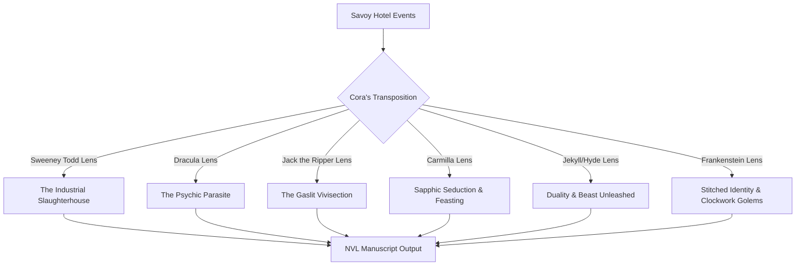

# Book 1 Abstraction and Narrative Variant Registry

This document serves as the central reference mapping how Cora's manuscript (`book1` - the Holywell Street penny dreadful layer) translates gameplay state, flags, and paths into specific narrative variants, and outlines how these stories are abstracted and grafted onto classic Victorian Gothic themes (Sweeney Todd, Dracula, Jack the Ripper, Carmilla, Dr. Jekyll and Mr. Hyde, Frankenstein).

---

## 1. Structural Mapping (Macro & Micro Layers)

The manuscript is written using a two-tiered variation model: **Macro-level Chapter Routing** (determining which core label block is called) and **Micro-level Passage Branching** (inlined within labels or split into sub-labels to evaluate specific gameplay decisions).

### A. Macro-Level Path Routing (The Chapter Buckets)

At the macro layer, the chapter key and dominant archetype determine the primary narrative backbone.

#### Day 101: Slop vs. Corrupted Alt
- **Trigger**: `player.corruption_level <= 2` -> **Slop Chapter** (`day1_slop_chapter`). The prose is respectable, bloodless, and generic. It represents Cora writing a safe, market-proof, and clean story to hide her true thoughts.
- **Trigger**: `player.corruption_level > 2` -> **Corrupted Alt Chapter** (`day1_chapter`). The prose is transgressive, vivid, and raw. Cora writes Alderwood's conservatory tryst where she witnessed Lady Beatrice's transgression and exploited it.

#### Archetype Focus (The Core Buckets)
Determined by `story.day1_corridor_state` (or resolved via dominant archetype in subsequent days):
- **Predator**: The narration is clinical, tactical, and focused on leverage. The heroine (Coralie Vale) is active, dominant, and matches high-status characters with cold ambition.
- **Prey**: The narration is intimate, vulnerable, and high-risk. Attraction and threat coexist; the heroine is exposed but alert, trading danger for fascination.
- **Ghost**: The narration is dispassionate, silent, and observational. The heroine is an invisible witness who records details from the shadows without direct interaction or visible pulse.

---

### B. Micro-Level Passage Hooks (Decision-Driven Variations)

Within each core path, specific gameplay choices create sentence-level or paragraph-level deviations.

| Gameplay Decision / Flag | Fictional Analogue (penny dreadful layer) | Narrative Impact / Passage Variant |
|--------------------------|-------------------------------------------|-------------------------------------|
| `story.day1_ledger_focus` | *Inspiration* vs. *Corruption* | - **Inspiration**: Emphasis on cost, structural observation, and aesthetic distance. - **Corruption**: Focus on appetite, leverage, transactional bargaining, and sharp edges. |
| `story.day1_stern_relation` | *Complicit* vs. *Subservient* vs. *Resistant* | - **Complicit**: Two conspirators sharing mutual guilt. - **Subservient**: A submissive dance under a critical hand. - **Resistant**: Trembling resistance, a bird beating against warm bars. |
| `story.day2_tea_choice` | *Predator* vs. *Prey* vs. *Ghost* teacup scene | Dictates Chapter II's theme and the overall resolution of the hatbox scandal. |
| `story.day2_contraband_state` | *Stolen & worn* vs. *Planted in trunk* | - **Stolen/Worn**: The secret is physically worn, adding sensual/tactile tension. - **Planted**: A narrative trick of misdirection, shifting suspicion onto others. |
| `story.missy_day2_trust_break` | Betrayal of Miri vs. Mercy | - **True**: Miri carries the curse; branded debt. - **False**: A page admitting repair and bittersweet mercy. |

---

## 2. Gothic Abstraction Themes (The Grafting Database)

To push the manuscript further from direct hotel simulation and into high literary abstraction, Cora's writing drafts graft her hotel experiences onto six classic Victorian Gothic motifs.

### Motif A: The Sweeney Todd Lens (Industrial Carnage & Erasure)
*Focus: Labor as consumption; the hotel as a machine that processes human lives into grease and profit.*

- **Sweeney Todd Abstraction Ideas**:
  - **Hotel Laundry & Boiling Steam**: Abstracted as the wash-house of a lunatic asylum or a bone-boiling factory. Lye and soap are described as acid meant to dissolve the skin of the workers.
  - **Vance's Laces / Wardrobe**: Reimagined as the flayed skins of previous servants, starched until they look like satin.
  - **Discretion / Silencing**: Silence is not politeness; it is the butcher's grease that keeps the wheels from screeching. Mr. Sterick (Stern) is the overseer who counts the tallow candles made from the fat of fallen girls.

### Motif B: The Dracula Lens (Hypnotic Parasitism & Blood Ties)
*Focus: Command as possession; submission as an addictive, sweet surrender of agency.*

- **Dracula Abstraction Ideas**:
  - **Gideon Locke (Lord Caldor)**: Abstracted as a pale aristocrat who does not walk, but glides. His gaze exerts a physical pressure that paralyzes the chest.
  - **Corridor Voyeurism**: Coralie does not simply spy through a door; she is drawn to the keyhole by a sweet, iron scent (blood/jasmine) and finds she cannot pull her eyes away even when the master looks back.
  - **The Trance of Service**: Dusting and cleaning are described as ritual pacification, sweeping away the salt barrier that keeps the spirits at bay.

### Motif C: The Jack the Ripper Lens (Gaslight Vivisection & Reputation Mutilation)
*Focus: Observation as surgery; the pen as a scalpel that slices open high-society sins.*

- **Jack the Ripper Abstraction Ideas**:
  - **The Ledger**: Cora's ledger is not a notebook; it is a clinical diary of dissections. Every character reference she extracts is an organ she has harvested.
  - **Alderwood/Conservatory Tryst**: Reimagined as a midnight anatomy lecture in a dark greenhouse. Beatrice is pinned to the desk not by a stablehand, but by a surgeon who is demonstrating how easily high-born flesh yields to steel.
  - **The Sussex Mask**: Coralie's English accent is described as a heavy plaster mask she holds to her face with bloody fingers.

### Motif D: The Carmilla Lens (Sapphic Seduction & Feasting)
*Focus: Forbidden intimacy, slow moral decay, and intoxicating touch in locked boudoirs; emotional and physical parasitism.*

- **Carmilla Abstraction Ideas**:
  - **Vance's Dressing Room**: The unlacing of the corset and unpinning of Vance's collar is written as a slow, delicious sting. The red pressure mark on Vance's collarbone is a bite where Coralie feeds on her pride.
  - **Missy's Trust**: Reimagined as a feverish, sleepwalking dependency in the dark servants' attic. The girls share secrets like blood, their identities blurring until it is unclear who is feeding on whom.

### Motif E: The Dr. Jekyll and Mr. Hyde Lens (Duality & Beast Unleashed)
*Focus: Duality of the self; the Sussex gentlewoman mask vs. the vengeful, dirt-caked Irish domestic; public refinement concealing beastly appetites.*

- **Jekyll/Hyde Abstraction Ideas**:
  - **The Voice Shift**: Coralie's Sussex accent is a physical draught she swallows to transform her posture. If the accent slips, the rough, heavy-handed Irish beast will show its claws.
  - **Gideon's Mastery (Lord Caldor)**: Lord Caldor is a refined scholar who transforms behind heavy study doors into a beast of raw, physical command, his walking stick acting as the instrument of his violence.

### Motif F: The Frankenstein Lens (Stitched Identity & Clockwork Golems)
*Focus: Assembling a false self from the scraps of others' lives; the horror of creation escaping the creator's hand.*

- **Frankenstein Abstraction Ideas**:
  - **The Manuscript**: Coralie is stitching together her novel from the dead scandals of Alderwood, sewing the hands of Lady Vayne's vanity to the tongue of Miri's fear.
  - **Servitude as Animation**: The maids are golems constructed from scrap cotton and lye-soap, moving solely by the galvanic spark of Mr. Sterick's keys in the lock.

---

## 3. Backlog of Abstraction Ideas (Days 1-5)

### Day 1: The Inciting Lever (Alderwood / Conservatory)
- **Sweeney**: Cora scrubs away the grease of Alderwood's kitchen, realizing Beatrice's secrets are the only currency that doesn't smell of tallow.
- **Dracula**: Lord Caldor's shadow looms over the greenhouse; Beatrice is drained of all color (like paraffin) under Coralie's cold gaze.
- **Ripper**: The tryst is written as a clinical division of Beatrice's social life—Coralie performs the first cut by demanding thirty sovereigns.
- **Jekyll/Hyde**: Coralie swallows her Wiltshire accent like a potion before facing Beatrice, keeping the wild Irish beast chained beneath her apron.

### Day 2: The London Train (The Sealed Hatbox)
- **Sweeney**: The train carriage is an iron cage transporting livestock to the London markets. The hatbox is a miniature coffin containing the shroud of a dead maid.
- **Dracula**: The compartment is suffocatingly narrow; the scent of spilled tea matches the scent of damp earth. Coralie hoards the contraband like a familiar hoarding a master's soil.
- **Carmilla**: The stolen underwear is described as a warm, stolen relic of Vance's flesh, worn close to the skin as a silent, secret feast of her presence.

### Day 3: The Savoy's Shadows (Gideon's Suite)
- **Sweeney**: Servitude under Stern becomes a factory line of bone-polishing. The brush choice (Predator/Prey/Ghost) is how Coralie handles the knife.
- **Dracula**: Gideon's tea is a draft of sleep; the suite is a crypt where the master's presence makes the wainscoting sweat.
- **Jekyll/Hyde**: Gideon's polite reception turns animalistic in private, his hand closing around Coralie's throat to check for her hidden beast.

### Day 4: The Fragile Lord (The Escaped Photograph)
- **Ripper**: The photograph is a plate of silver nitrate that has captured a ghost. Burning it is described as destroying the only evidence of a murder.
- **Dracula**: Coralie escapes through the fireplace/window like a bat or a shadow, leaving Missy behind to face the master's hunger.
- **Frankenstein**: The stolen photograph is a piece of Lord Caldor's heart, ripped out of his chest to animate Coralie's own creation.

### Day 5: A Mask Fixed Forever (The Reckoning)
- **Dracula**: The final contract is a blood covenant. Refusing the money is maintaining the salt circle; taking the money is accepting the brand.
- **Sweeney**: The manuscript is published—not as a novel, but as a street pamphlet printed in cheap grease-ink, sold to crowds who watch the Savoy burn from the street.
- **Carmilla**: Coralie and Vance's final confrontation is written as a mutual feeding, where they consume each other's reputation to achieve a shared, damned eternity in Holywell Street's print shops.

---

## 4. Writers' Brief: Heavy Adults-Only Dark Romance Focus

To align with the target market and the core psychological themes of the novel, the manuscript must be drafted with a **heavy, uncompromising adults-only dark romance lens**.

Writers must follow these rules to maintain the heat and tension of the text:

1. **Taboo and Power Play**: Focus heavily on themes of domination, submission, and transaction. The relationship between Coralie and the high-status characters (Lord Caldor, Lady Vayne) must feel dangerous, forbidden, and highly charged with physical threat and moral surrender.
2. **Tactile & Visceral Details**: Avoid euphemisms. Describe the heavy scents of the environment (jasmine, damp soil, cold stone, boiling lye, sweat, and copper), the warmth of skin under rough aprons, the red pressure marks of command, and the physical shiver of being touched or exposed.
3. **The Intoxication of Danger**: The heroine's fear must not be pure panic; it must be bound to a dark, compulsive fascination. She walks toward threat because the hazard itself is warm.
4. **Unapologetic Appetite**: Coralie's writing does not seek absolution or respectable safety. Even on the prey path, the text must focus on the raw, wet, and heavy physical realities of the encounters. Keep the tension taut, the stakes bodily, and the romance dark.
5. **Public Domain Execution**: Since these classic gothic source texts (*Dracula*, *Carmilla*, *Frankenstein*, *Dr. Jekyll & Mr. Hyde*, *Sweeney Todd*, etc.) are entirely in the public domain, writers are encouraged to lean on them heavily. Parody classic passages, echo famous prose styles, borrow structural beats, or invert iconic gothic tropes to elevate the salacious penny-dreadful style where it makes sense.

