# Story Board Lineage & Ownership

This storyboard is a human-readable planning, review, and continuity artifact derived from the Release 1 non-canon `.rpy` draft scripts.

The `.rpy` files are the structural source of truth for graph extraction:

`main-game/non-prod-game/game/days/*.rpy`
`main-game/non-prod-game/game/shared/*.rpy`

This file must not be treated as the primary machine-readable source for routing, DAG tags, menu structure, gates, stat effects, or graph manifests. Those are extracted from `.rpy` scripts plus optional `[DAG_*]` comments.

## Managing Skills / Workflows

This storyboard is created, refreshed, or audited by these workflows:

| Workflow / Skill | Role |
|------------------|------|
| `produce_day` | Creates new day draft structure that may later be reflected in this storyboard. |
| `rewrite_narrative` | May change `.rpy` structure; storyboard must be audited afterward. |
| `revise_narrative` | May change labels, branches, gates, or prose continuity; storyboard drift should be checked afterward. |
| `implement_spec` | May add technical scaffolding to `.rpy`; storyboard should only be updated if structural intent changes. |
| `dag_tag_update` | Adds or refreshes `[DAG_*]` comments in `.rpy`; triggers graph manifest regeneration and storyboard drift audit. |
| `storyboard_sync` | Updates this storyboard from current `.rpy` scripts and graph audit outputs after manual or agent-authored rewrites. |
| `documentation_audit` | Refreshes documentation references and confirms this lineage note remains accurate. |

## Direction Of Truth

```text
.rpy draft scripts + optional DAG tags
        |
        v
graph manifest / CSVs / audit reports
        |
        v
storyboard drift notes and human documentation updates
```

The storyboard may guide human planning, but future agents must not reverse the direction and generate the playable or extractable graph from this file alone.

---

# Untitled Victorian VN — Storyboard (Release 1 - MVP)

> **Legend**
> 📌 Notes · 🚩 Flag Seeded · ⚖️ Stat Gated · 🚪 Branch Point

---

## Story Structure — MVP Path

```mermaid
flowchart TD
    D100[Day 100 Prologue: The Train & The Discovery] --> D101M[Day 101 Morning: Interview & Collision]
    D101M --> D101A[Day 101 Afternoon: Corridor Eavesdrop]
    D101A --> D101T[Day 101 Twilight: The Ledger]
    D101T --> D101N[Day 101 Night: The Manuscript]
    D101N --> D102M[Day 102 Morning: First Shift / Contraband Discovery]
    D102M --> D102C[Day 102 Chore Time: Corridor vs Inspiration]
    D102C --> D102A[Day 102 Afternoon: Vance's Meltdown / Crisis Choice]
    D102A --> D102N[Day 102 Night: Write or Indulge]
    D102N --> D103M[Day 103 Morning: Consequences & Grind]
    D103M --> D103A[Day 103 Afternoon: The Summons / Brush Test]
    D103A --> D103T[Day 103 Twilight: Stabilize or Write]
    D103T --> D103N[Day 103 Night: Ultimatum Defiance / Bargain]
    D103N --> D104M[Day 104 Morning: Heist & Lockbox Breach]
    D104M --> D104A[Day 104 Late Afternoon: Early Return & Escape]
    D104A --> D104T[Day 104 Twilight: Suspicion Trap vs Repair]
    D104T --> D104N[Day 104 Night: Triumphant Chapter / Exhaustion]
    D104N --> D105M[Day 105 Morning: The Summons]
    D105M --> D105A[Day 105 Afternoon: Leverage Collapses / Interrogation]
    D105A --> D105N[Day 105 Night: Manuscript Reckoning & Final Cut]
    D105N --> End[End of MVP Demo]
```



---

## Coding, Class, and Style Conventions
> **Adherence to `chief_architect.md` rules is mandatory.**

1. **State Contract Integrity**: All flags are maintained within the `StoryState` class layer via setters (e.g., `story.set_corridor_state("prey")`). No ad hoc `default story.day1_corridor_state = ...` assignments in episodic scripts. Mutually exclusive branches use a single string and a whitelisted setter.
2. **Label Naming**: `day[R][dd]_[p]_[location_description]` where R is Release (1) and dd is the day (01-05). Example: `day103_2_suite_gideon_tea`.
3. **Symbols & Speakers**: All speaker tokens (e.g., `cora`, `stern`) must map to defined `Character` objects in `characters.rpy`. All stat effects must use `apply_effects()`.
4. **Passage-Level Design**: Non-canon drafts serve as **design intent**. They hold the narrative structure, the dialogue, and the flow, which are then strictly parsed into the canon `dayrdd.rpy` scripts. Graph extraction reads the `.rpy` drafts directly rather than reverse-engineering this storyboard.
5. **Graph Annotation**: Structural `.rpy` labels, menus, gates, and router exits may include thin `[DAG_*]` comments. These comments are non-player-facing technical metadata used by the graph manifest extractor. They must not replace `[STATE]`, `[CHOICE]`, `[BEAT]`, or `[ASSET]` markers. Human-authored DAG comments may be marked `manual`; tag-update agents must skip those unless explicitly instructed to overwrite manual DAG tags.

---

## Global State Tracking (Day 100-105)

### 🚩 Key Narrative Flags

| Flag Name | Set In | Function / Forward Impact |
|-----------|--------|---------------------------|
| `prologue_found` | Day 100 | `"overheard"` or `"read_letters"` — seeds Cora's initial thematic inclination. |
| `prologue_why_write` | Day 100 | `"money_home"` / `"cataloguer"` / `"scandal_hungry"` — seeds manuscript motive for book1. |
| `prologue_holywell_posture` | Day 100 | `"careful"` / `"eager"` / `"desperate"` — seeds illicit-publisher risk appetite. |
| story.day1_interview_state | Day 101 | `"meek"` / `"competent"` — early suspicion shaping with Stern. |
| story.day1_corridor_state | Day 101 | `"predator"` / `"prey"` / `"ghost"` — determines Chapter 1 prose and Day 2's contraband branch. |
| story.day1_ledger_focus | Day 101 | `"inspiration"` / `"corruption"` — dictates the framing of the writing or indulgence. |
| story.missy_day1_trust_state | Day 101 | `"soothed"` / `"unsettled"` / `"warned_cora"` / `"shared_caution"` — tracks early relationship with Missy. |
| story.day2_contraband_state | Day 102 | `"stolen_wearing"` / `"planted_in_trunk"` — outcome of the morning discovery; shapes the tea crisis. |
| story.day2_tea_choice | Day 102 | `"prey"` (confess) / `"predator"` (pretend to find) / `"ghost"` (frame Missy) — drives the Day 3 consequence. |
| story.missy_day2_trust_break | Day 102 | Boolean — True if Missy is framed (`"ghost"`). |
| story.day3_brush_choice | Day 103 | `"predator"` (accomplice) / `"prey"` (deviant) / `"ghost"` (mouse) — Gideon mirror test. |
| story.day3_ultimatum | Day 103 | `"defied"` / `"bargained"` / `"surrendered"` — response to Gideon's 9 PM demand. |
| story.day4_escape_state | Day 104 | `"fireplace"` / `"bold_lie"` / `"missy_cover"` — survival method affecting suspicion and Missy. |
| story.has_photograph | Day 104 | Boolean — True if Cora escaped with the evidence. |
| story.day5_dynamic | Day 105 | `"muse"` / `"protege"` / `"adversary"` / `"witness"` — Gideon's assessment of Cora's true motivation. |
| story.day5_money_choice | Day 105 | `"taken"` / `"refused"` / `"deferred"` — affects entanglement for Release 2. |
| story.gideon_entanglement_level | Day 105 | `"accepted_money"` / `"refused_money"` / `"deferred_money"` — tracks Gideon leverage/money status for Release 2. |
| story.cora_release1_flavour | Day 105 | `"observer"` / `"predator"` / `"prey"` / `"ghost"` — carries forward Cora's accumulated archetype. |
| story.stern_chain_level | Day 101-104 | Integer `[0, 3]` — tracks Cora's optional relationship progression with Miss Stern. |
| story.missy_chain_level | Day 101-104 | Integer `[0, 3]` — tracks Cora's optional relationship progression with Missy. |
| story.vance_chain_level | Day 101-104 | Integer `[0, 3]` — tracks Cora's optional relationship progression with Vance. |
| story.penance_triggered | Day 101-104 | Boolean — True when a personal character confrontation is triggered by combined suspicion ≥ 50. |

### ⚖️ Hard Mechanic Gates

#### 🧠 The Accumulated Anxiety Design (Option B)
* **Two-Tiered Suspicion State**: Each tracked character (Stern, Vance, Gideon, Missy) maintains two independent pools of suspicion:
  * **Base Suspicion (`base_susp`)**: Permanent, established suspicion level reflecting structural plot events. Base suspicion is never naturally decayed.
  * **Acute Suspicion (`acute_susp`)**: Volatile, temporary heat generated by suspicious interactions (lies, snooping, wearing contraband). Acute suspicion is managed through gameplay actions.
  * **Headroom Squeezing**: For each character, the combined suspicion ($base/_susp + acute/_susp$) is strictly capped at 100. Permanent base suspicion takes precedence; if base suspicion increases programmatically at a major milestone and causes the combined total to exceed 100, the acute suspicion is automatically **squeezed** (reduced) to fit within the remaining headroom.
  * **Asymptotic Acute Decay**: During optional grind or appeasement steps, acute suspicion naturally decays according to each character's specific decay rate $d$:
    $$S_t = S_0 /cdot (1 - d)$$
    * **Missy**: $d = 0.90$ (instant reset, Teflon Slate)
    * **Vance**: $d = 0.60$ (rapid reset, oblivious)
    * **Gideon**: $d = 0.50$ (shifting equation, cold observer)
    * **Stern**: $d = 0.15$ (slow decay, requires grueling labor)
* **Derived Consolidated Anxiety (Independent Probability)**: Global `player.anxiety` is derived using independent probability theory, reflecting the compound probability of Cora getting caught by *at least one* active observer:
  $$/text{Anxiety} = 100 /cdot /left(1 - /prod_{c} /left(1 - /frac{/text{Susp}_c}{100}/right)/right)$$
  Where $/text{Susp}_c$ is the combined suspicion ($base/_susp + acute/_susp$ capped at 100) for each witness $c /in /{/text{stern, vance, gideon, missy}/}$.
* **HUD/Compatibility Mirroring**: For compatibility with existing `.rpy` scripts, getter properties (e.g. `player.stern_suspicion`, `player.gideon_suspicion`) automatically return the combined total capped at 100.
* **Confrontation & Penance Check**: Named consequence windows call `check_confrontations`. If any individual combined suspicion is $/ge 50$, the check queues a concrete personal confrontation label. The window consumes the queue with `story.pop_penance_for_window(...)`, calls that confrontation, and returns to the day-owned spine.
  1. Consumes the active consequence window, not the global route table.
  2. Reduces that character's acute suspicion by 35, providing immediate anxiety relief.
* **Vigilance / Breakdown Gate (Game Over)**: Reaching 100 consolidated Anxiety (either through a single combined suspicion hitting 100 or the compounded pressure of multiple suspicious observers) immediately triggers the game_over_dismissed fail-state—a nervous breakdown where Cora's mask cracks and she is dismissed by Miss Stern.
* **Day 4 Write Paralysis**: Reaching 85 consolidated Anxiety during Day 4 Twilight blocks the Triumphant Write due to internal panic.

#### 📅 Two-Step Slot Integration
To preserve crucial narrative forks and chapter variants without sacrificing optional grinds, active slots utilize a two-step flow:
1. **Reflection Step**: The ledger or afternoon chore choice is presented first, setting essential focus flags (day1_ledger_focus, day2_chore_focus, day3_corridor_chain).
2. **Optional Grind Step**: The day file presents a **contextual** story window. Each option resolves the next relationship beat with `story.resolve_chain_label(character)`, calls that beat, and then returns to the day spine. Relationship chains have 3 levels and are gated by `story.chain_available(character)`. Desk retreat and normal exits now jump directly where the next day-owned label is obvious.

#### 🎯 Daily Story Gates

Writing gates use **AND** semantics (`has_story_fuel` in `functions_non_canon.rpy`): both inspiration and corruption_level must meet their floors. Constants: `WRITE_GATE_CH1` (15, 2), `WRITE_GATE_CH2` (30, 3), `WRITE_GATE_CH3` (45, 3).

- **Day 101 Night:** Write menu and Chapter One require **CH1 gate** (inspiration ≥ 15 **and** corruption_level ≥ 2). Below corruption_level 3 on the page → slop draft (no `manuscript_progress`); at or above → real Ch1 + progress.
- **Day 102 Night:** Ch1 catch-up requires **CH1 gate** (if missed); Ch2 requires **CH2 gate** (30 / 3). Alternative indulgence trades manuscript progress for stats.
- **Day 103 Night:** Chapter Three requires **CH3 gate** (45 / 3), or frantic_write bypass.
- **Day 104 Twilight:** If **Anxiety ≥ 85** (`ANXIETY_WRITE_PARALYSIS`), triumphant write is blocked. Atonement always available; Missy repair when `missy_day4_used_as_cover`.
- **Day 105 Morning:** Leverage defusal is structural. The photograph cannot defeat Gideon's class privilege, but the motivation confessed shapes Cora's arc and ending manuscript reckoning.

#### Adult Payoff Structure: Manuscript Retelling Minigame
- **Design purpose:** The IRL Savoy scenes may remain restrained, plausible, and socially dangerous; the explicit H-scene payoff is delivered when Cora rewrites those lived experiences into her forbidden manuscript.
- **Core loop:** On **Day 101 or Day 102**, the first writing minigame recontextualises the corridor eavesdrop / contraband discovery into a spicier prose retelling. On **Day 103 or Day 104**, a second writing minigame recontextualises the brush test, Gideon summons, or false-dawn leverage material into a more charged manuscript version.
- **Presentation:** The player sees the same scene logic again through Cora's imagination, with heightened sensual detail, altered power emphasis, and CG edits/overlays that make clear this is the book's eroticised version rather than literal hotel action.
- **Tone rule:** The manuscript layer can be hotter, more symbolic, and more physically explicit than the IRL hotel layer, but it should still reveal Cora's psychology: what she changes, exaggerates, omits, or makes herself enjoy is the point of the scene.
- **Market role:** These minigame retellings are the MVP's primary adult-game handshake for the F95-style niche. The player should understand that writing is not only progression currency; it is where Cora converts danger into content.
- **Branch memory:** The prose and CG edit should reflect prior flags (day1_corridor_state, day1_ledger_focus, day2_contraband_state, day2_tea_choice, day3_brush_choice, day3_ultimatum, day4_escape_state) so the fantasy payoff feels authored by the player's version of Cora.

---

## MVP Spine Routing (Day-Owned Time Contract)

> **Purpose:** Choices change stats, flags, and flavour dialogue, but the run reconverges on day-owned time labels and named dynamic windows. Current non-canon routing no longer relies on `end_slot` or `advance_after_confrontation` for migrated Day 101-104 story-chain and penance flow.
> **Source draft:** `story_chains_non_canon.rpy` plus the day files under `game/days/`.

### Graph Audit Links

Latest generated graph manifest:

`main-game/pipeline/releases/release-1-mvp/graph/release1_graph_manifest.json`

Latest graph gaps:

`main-game/pipeline/releases/release-1-mvp/graph/release1_graph_gaps.md`

Latest graph audit:

`main-game/pipeline/releases/release-1-mvp/graph/release1_graph_audit.md`

Manual `.rpy` rewrites should be followed by `storyboard_sync`, which updates this file from the current scripts and graph audit outputs. This keeps the storyboard current as documentation while preserving the rule that `.rpy` scripts remain the structural source of truth.

### Slot type legend

| Symbol | Meaning |
|--------|---------|
| **WORK** | Mandatory plot; always runs; no optional chain menu. |
| **STORY WINDOW** | Optional contextual chain menu. The day file resolves a chain label, calls it, and resumes the day spine. |
| **CONSEQUENCE WINDOW** | Named penance check window. It calls `check_confrontations`, pops any queued penance label, calls it, and resumes the day spine. |
| **WRITE** | Night, twilight, or final manuscript beat. |
| **DEADLINE** | Manuscript-progress gate that can jump to a fail state. |

Penance is queued in story.pending_penance and consumed by named consequence windows. The deprecated compatibility routers remain in shared scripts for migration safety, but migrated labels do not call them.

### Spine sequence (labels only)

| Step | Day | Period | Type | Enter label | Sets / gates |
|------|-----|--------|------|-------------|--------------|
| 0 | 100 | - | WORK | `day100_main` | prologue_found -> D1 |
| 1 | 101 | Morning | WORK | `day101_main` -> `day101_1_cora_waiting` -> `day101_1_morning_interview` -> `day101_1_vance_throws_toy` | day1_interview_state |
| 2 | 101 | Afternoon | WORK | `day101_2_missy_meets_cora` -> `day101_2_coras_path_choice` | day1_corridor_state |
| 3 | 101 | Evening | CONSEQUENCE | `day101_evening_consequence_window` | Queues and consumes confrontation labels before ledger prose continues. |
| 4 | 101 | Night | STORY WINDOW / WRITE | `day101_night_story_window` -> `day101_4_write_the_chapter` or direct D102 handoff | Ch1 fuel gate; candidate first manuscript retelling minigame. |
| 5 | 102 | Morning | WORK | `day102_1_cora_missy_first_shift` -> `day102_1_missy_finds_a_thing` -> takes/deceives | day2_contraband_state |
| 6 | 102 | Afternoon | CONSEQUENCE / STORY WINDOW | `day102_afternoon_consequence_window` -> `day102_afternoon_story_window` | Chore insp/corr -> chains or direct crisis handoff. |
| 7 | 102 | Evening | WORK | `day102_3_stern_fetches_cora` -> `day102_3_vance_goes_incandescent` -> `day102_3_coras_choice` -> `day102_3_gideon_interrupts_controls_vance` | day2_tea_choice |
| 8 | 102 | Night | CONSEQUENCE / WRITE | `day102_night_consequence_window` -> `day102_4_night` -> write or indulge | Ch1 catch-up / Ch2 or indulge. |
| - | 103 | Morning | DEADLINE | `day103_morning` | If manuscript_progress == 0 -> deadline fail. |
| 9 | 103 | Morning | CONSEQUENCE / STORY WINDOW | `day103_morning_consequence_window` -> `day103_1_servants_corridor` -> `day103_1_optional_character_chain` | D2 consequence; corridor insp/corr -> chains. |
| 10 | 103 | Afternoon | WORK | `day103_afternoon` -> `day103_2_suite_gideon_tea` -> `day103_2_suite_gideon_beat` | day3_brush_choice; 9 PM order. |
| 11 | 103 | Evening | CONSEQUENCE / WORK | `day103_evening` -> `day103_evening_consequence_window` -> `day103_3_bedroom_cora_frantic_writing_event` | Twilight action; always -> Stern. |
| 12 | 103 | Evening | WORK | `day103_4_room_stern_suspicion` | Stern summons. |
| 13 | 103 | Night | CONSEQUENCE / WORK | `day103_night` -> `day103_night_consequence_window` -> `day103_2_suite_night_tea` | day3_ultimatum. |
| 14 | 103 | Night | WRITE | `day103_3_bedroom_final_write` | Ch3 fuel gate or barricade; candidate second retelling minigame. |
| 15 | 104 | Morning | WORK | `day104` -> `day104_morning` -> `day104_1_false_dawn_suite_window` -> `day104_1_lockbox_evidence` | has_photograph |
| 16 | 104 | Afternoon | WORK | `day104_2_return_early` -> escape branches | day4_escape_state |
| 17 | 104 | Evening | CONSEQUENCE / WORK | `day104_evening` -> `day104_3_stern_pressure` -> `day104_evening_consequence_window` -> `day104_4_twilight_ledger_false_dawn` | Anxiety >= 85 blocks triumphant write. |
| 18 | 104 | Night | CONSEQUENCE / WRITE | `day104_night` -> `day104_night_consequence_window` -> `day104_5_triumphant_chapter` or `day104_6_false_dawn_ending` | D4 penance skips triumphant. |
| - | 105 | Morning | DEADLINE | `day104_6_false_dawn_ending` | If manuscript_progress < 2 -> deadline fail. |
| 19 | 105 | Day | WORK | `day105_1_monster_reemerges` -> summons -> leverage -> motivation -> marks | day5_dynamic, money. |
| 20 | 105 | Night | WRITE | `day105_6_manuscript_reckoning` | Final chapter. |
| 21 | 105 | Morning | WORK | `day105_7_release_one_ending` | MVP end. |

WORK blocks within a period keep normal `jump` to the next label in the same period. Cross-period and cross-day handoffs now use explicit day-owned labels where the next target is obvious.

### Dynamic windows

| Window | Role | Returns / handoff |
|--------|------|-------------------|
| `day101_evening_consequence_window` | Checks and consumes queued penance before Day 101 evening ledger flow. | D102 morning if penance fires; otherwise returns. |
| `day101_night_story_window` | Optional Day 101 chain menu; calls chain labels and resumes. | D102 morning. |
| `day102_afternoon_consequence_window` | Checks and consumes queued penance before Day 102 afternoon flow. | Day 102 evening crisis if penance fires; otherwise returns. |
| `day102_afternoon_story_window` | Optional Day 102 chain menu; replaces `day102_2_optional_character_chain` as the normalized window. | Day 102 evening crisis. |
| `day102_night_consequence_window` | Checks and consumes queued penance before Day 102 night flow. | Day 103 morning if penance fires; otherwise returns. |
| `day103_morning_consequence_window` | Checks and consumes queued penance at Day 103 entry. | Day 103 afternoon if penance fires; otherwise returns. |
| `day103_evening_consequence_window` | Checks and consumes queued penance before Day 103 evening writing event. | Stern suspicion beat if penance fires; otherwise returns. |
| `day103_night_consequence_window` | Checks and consumes queued penance before Day 103 night write. | Day 104 handoff if penance fires; otherwise returns. |
| `day104_evening_consequence_window` | Checks and consumes queued penance before Day 104 twilight choice. | Day 104 night if penance fires; otherwise returns. |
| `day104_night_consequence_window` | Checks and consumes queued penance before Day 104 triumphant chapter. | False-dawn ending if penance fires; otherwise returns. |

### `check_confrontations` entry points

| Day | Named consequence windows |
|-----|---------------------------|
| 101 | `day101_evening_consequence_window` |
| 102 | `day102_afternoon_consequence_window`, `day102_night_consequence_window` |
| 103 | `day103_morning_consequence_window`, `day103_evening_consequence_window`, `day103_night_consequence_window` |
| 104 | `day104_evening_consequence_window`, `day104_night_consequence_window` |

Do not place **CHECK** inside mandatory WORK blocks (tea crisis, Gideon suite, escape) unless penance interrupt mid-plot is explicitly intended.

### Closeout notes

| Item | Current state |
|------|---------------|
| Optional chain exits | Migrated chain labels return to callers; day windows call them. |
| Confrontation exits | Migrated confrontation labels return to callers; consequence windows consume queued penance. |
| Day 101 / 102 normal exits | Non-canon and production Day 101/102 use direct obvious jumps instead of `end_slot`. |
| Deprecated routers | `advance_after_confrontation` and `end_slot` remain as compatibility labels only. |
| Graph drift | Storyboard reflects the current dynamic-window spine; remaining graph gaps are extractor metadata/balancing follow-ups unless flagged otherwise in `release1_graph_gaps.md`. |

### Spine flow (periods only)

```mermaid
flowchart LR
  subgraph D1
    A1[WORK am/pm] --> R1[REFLECT eve]
    R1 --> W1[WRITE night]
  end
  subgraph D2
    A2[WORK am] --> R2[REFLECT pm]
    R2 --> C2[WORK eve tea]
    C2 --> W2[WRITE night]
  end
  subgraph D3
    R3[REFLECT am] --> G3[WORK pm]
    G3 --> T3[WORK eve]
    T3 --> U3[WORK night tea]
    U3 --> W3[WRITE night]
  end
  subgraph D4
    H4[WORK am] --> E4[WORK pm]
    E4 --> L4[twilight WRITE]
    L4 --> F4[false dawn]
  end
  subgraph D5
    S5[WORK day] --> W5[WRITE night]
    W5 --> END[ending]
  end
  W1 --> A2
  W2 --> R3
  W3 --> H4
  F4 --> S5
```



### Scene exit rules (current routing closeout)

| Do | Do not |
|----|--------|
| Let day-owned labels and named dynamic windows control time-period routing. | Reintroduce `jump expression _chain_label` from day menus. |
| Use `call expression _chain_label` for optional chain beats, then return to the current day spine. | Route migrated chains or confrontations through `advance_after_confrontation`. |
| Keep `check_confrontations` inside named `*_consequence_window` labels. | Place confrontation checks directly in ordinary WORK labels. |
| Use direct jumps for obvious Day 101/102 handoffs already represented in the day spine. | Add new `end_slot` calls for migrated normal flow. |

### Closeout status

| Item | Current state |
|------|---------------|
| Day 101 story window | `day101_night_story_window` owns optional chain calls before Day 102 handoff. |
| Day 102 afternoon window | `day102_afternoon_story_window` replaces the old optional-character-chain route. |
| Day 104 spine | `day104`, `day104_morning`, `day104_evening`, and `day104_night` provide clear day-owned routing in non-canon draft. |
| Penance routing | `check_confrontations` queues labels; consequence windows consume with `pop_penance_for_window(...)`. |
| Compatibility routers | `advance_after_confrontation` and `end_slot` remain only as deprecated compatibility labels. |

---

## Scene Ledger & Passage Flow

### Day 100 (Prologue / Tutorial)
*Source: `day100_non_canon.rpy`*
- **`day100_main` (Morning)**: Third-class train; voice tutorial (narrator / `cora_inner` / `cora`); stat sidebar intro.
- **`day100_1_afternoon_boredom`**: Boredom reading; Holywell handbill; `prologue_why_write` + `prologue_holywell_posture`.
- **`day100_2_evening_flashback`**: Wiltshire discovery (`prologue_found`: overheard / read_letters).
- **`day100_3_night_daydream`**: Daydream-framed spice (~2.8) toward Holywell / authorship.
- **`day100_3_arrival`**: Waterloo; handoff to Day 101.

### Day 101
*Source: day101_non_canon.rpy*
- **`day101_1_cora_waiting` & `day101_1_morning_interview`**: First encounter with Stern. Choice between "meek" or "competent".
- **`day101_1_vance_throws_toy`**: Initial corridor collision with Vance and Gideon.
- **`day101_2_missy_meets_cora` & `day101_2_coras_path_choice`**: Laundry room intro. The eavesdrop event branches day1_corridor_state ("predator", "prey", "ghost").
- **`day101_3_taking_stock_day1`**: Ledger choice between "inspiration" (structural) or "corruption" (appetite), preceded by `day101_evening_consequence_window`.
- **`day101_night_story_window` & `day101_4_write_the_chapter`**: Night story-chain window and Chapter 1 writing path. Cora eroticises the corridor eavesdrop according to day1_corridor_state and day1_ledger_focus, with CG edits that distinguish imagined manuscript content from literal hotel events.

### Day 102
*Source: day102_non_canon.rpy*
- **`day102_1_cora_missy_first_shift` & `day102_1_missy_finds_a_thing`**: Missy discovers contraband.
- **`day102_1_cora_takes_the_thing` / `day102_1_cora_deceives_missy`**: Branch dictated by Day 1 corridor choice. Cora either wears the stolen item or plants it.
- **`day102_2_day2_chore_time` -> `day102_afternoon_consequence_window` -> `day102_afternoon_story_window`**: Chore choice and optional story-chain window.
- **`day102_3_stern_fetches_cora` & `day102_3_vance_goes_incandescent`**: The crisis begins over the missing item.
- **`day102_3_coras_choice`**: The massive three-way branch sets day2_tea_choice ("prey", "predator", "ghost").
- **`day102_3_gideon_interrupts_controls_vance`**: Gideon diffuses the situation to maintain quiet, observing Cora.
- **`day102_night_consequence_window` -> `day102_4_cora_writes_a_chapter` / `day102_4_cora_sneaks_a_feel`**: Night writing check (Ch1/Ch2) or indulgence. If Day 101 did not host the first retelling, this slot should transform the contraband/lace crisis into Cora's spicier authored version.

### Day 103
*Source: `day103_non_canon.rpy`*
- **`day103_1_servants_corridor`**: Morning consequence of Day 2 choices (Vance's wrath, Stern's inspection, or Missy's silence).
- **`day103_2_suite_gideon_tea` & `_cora_vs_gideon`**: Cora is summoned. The Hairbrush Test (day3_brush_choice).
- **`day103_2_suite_gideon_beat`**: Gideon orders her to return at 9 PM alone.
- **`day103_3_bedroom_cora_frantic_writing_event`**: Twilight action. Frantic write, mask prep, or indulging the words.
- **`day103_4_room_stern_suspicion`**: Stern questions Cora's summons.
- **`day103_2_suite_night_tea`**: The 9 PM encounter. Ultimatum choice: `"defied"`, `"bargained"`, `"surrendered"`.
- **`day103_3_bedroom_final_write`**: Write the chapter (requires high stats) or barricade the door. Candidate second manuscript retelling minigame: Cora converts the brush test / 9 PM summons into a heightened erotic manuscript scene shaped by day3_brush_choice and day3_ultimatum.

### Day 104
*Source: `day104_non_canon.rpy`*
- **`day104_1_false_dawn_suite_window` & `_lockbox_evidence`**: Cora breaks into the lockbox and discovers the photograph.
- **`day104_2_return_early` & Escape**: Gideon and Vance return. Cora escapes via `"fireplace"` (soot), `"bold_lie"` (visible), or `"missy_cover"` (betrayal).
- **`day104_3_stern_pressure`**: Dealing with Stern's suspicion.
- **`day104_4_twilight_ledger_false_dawn`**: The Suspicion soft lock. Atonement or Missy Repair vs Triumphant Write.
- **`day104_5_triumphant_chapter` / `_false_dawn_ending`**: If safe, Cora completes a triumphant "false dawn" chapter. If Day 103 did not host the second retelling, this slot should make the false-dawn manuscript scene the second adult payoff, with Cora's imagined victory hotter and more absolute than the IRL leverage situation can be.

### Day 105
*Source: `day105_non_canon.rpy`*
- **`day105_1_monster_reemerges` & `_the_summons`**: The false dawn ends. Gideon summons Cora over the lockbox.
- **`day105_3_leverage_collapses`**: Gideon dismantles the notion that a servant's truth matters against class structure.
- **`day105_4_why_did_you_do_it`**: Cora's motivation sets day5_dynamic (`"muse"`, `"protege"`, `"adversary"`, `"witness"`).
- **`day105_5_gideon_marks_cora`**: Evidence is burned/secured. Gideon leaves a money envelope.
- **`day105_6_manuscript_reckoning`**: Night writing. The final MVP chapter is written, reframing the story.
- **`day105_7_release_one_ending`**: Morning departure. Gideon marks Cora. Carry-forward flags are set for Release 2.

---

## Assets Checklist

### Backgrounds
- `interior/train_carriage (day)` (Day 100)
- `interior/country_estate_study` (Day 100)
- `bg_savoy_corridor (morning)`
- `bg_laundry_room (day)`
- `bg_servants_corridor (dim, day, morning)`
- `bg_servants_quarters (dusk)`
- `bg_cora_desk (night)`
- `bg_master_suite (day, tea, night)`

### Music & Sound
- `themes/melancholy`
- `sfx/train_whistle`
- `themes/savoy_tension`
- `themes/servants_floor_unease`
- `themes/private_ink`
- `themes/master_suite_pressure`
- `themes/predator_game`
- `themes/defiance_and_dread`
- `ambient/laundry_steam`
- `ambient/hotel_corridor_muffled`
- `ambient/servants_quarters_dusk`
- `ambient/master_suite_quiet`
- `ambient/fireplace_low`
- `sfx/corridor_slap_muffled`
- `sfx/floorboard_creak`
- `sfx/ink_scratch`
- `sfx/washbasin_clatter`
- `sfx/lockpick_tension`
- `sfx/key_in_door`
- `sfx/brush_drop_clatter`
- `sfx/door_handle_jiggle`

### Character Sprites
- **Cora**: (Implied base presence, guarded, focused, flushed)
- **Missy**: `smiling`, `shocked`, `confused`
- **Vance**: `angry`, `submissive`, `defeated`, `cowed`, `confused`
- **Gideon**: `cold`, `neutral`, `dominant`, `angry`
- **Miss Stern**: `neutral`, `stern`

### CG / UI Callouts
- `show_ledger_ui()`
- `writing_minigame_ui` (Day 101/102 and Day 103/104 manuscript retellings)
- `cg_manuscript_retelling_d1_corridor` (imagined rewrite / edited CG variant)
- `cg_manuscript_retelling_d2_lace` (imagined rewrite / edited CG variant)
- `cg_manuscript_retelling_d3_brush` (imagined rewrite / edited CG variant)
- `cg_manuscript_retelling_d4_false_dawn` (imagined rewrite / edited CG variant)
- `cg_gideon_photograph` (Day 104/105)
- `cg_photograph_burning` (Day 105)
