# Untitled Victorian VN — Storyboard (Release 1 - MVP)

> **Legend**
> 📌 Notes · 🚩 Flag Seeded · ⚖️ Stat Gated · 🚪 Branch Point

---

## Story Structure — MVP Path

```mermaid
flowchart TD
    D100[Day 100 Prologue: The Train & The Discovery] --> D101M[Day 101 Morning: Interview & Collision]
    D101M --> D101A[Day 101 Afternoon: Corridor Eavesdrop]
    D101A --> D101T[Day 101 Twilight: The Ledger]
    D101T --> D101N[Day 101 Night: The Manuscript]
    D101N --> D102M[Day 102 Morning: First Shift / Contraband Discovery]
    D102M --> D102C[Day 102 Chore Time: Corridor vs Inspiration]
    D102C --> D102A[Day 102 Afternoon: Vance's Meltdown / Crisis Choice]
    D102A --> D102N[Day 102 Night: Write or Indulge]
    D102N --> D103M[Day 103 Morning: Consequences & Grind]
    D103M --> D103A[Day 103 Afternoon: The Summons / Brush Test]
    D103A --> D103T[Day 103 Twilight: Stabilize or Write]
    D103T --> D103N[Day 103 Night: Ultimatum Defiance / Bargain]
    D103N --> D104M[Day 104 Morning: Heist & Lockbox Breach]
    D104M --> D104A[Day 104 Late Afternoon: Early Return & Escape]
    D104A --> D104T[Day 104 Twilight: Suspicion Trap vs Repair]
    D104T --> D104N[Day 104 Night: Triumphant Chapter / Exhaustion]
    D104N --> D105M[Day 105 Morning: The Summons]
    D105M --> D105A[Day 105 Afternoon: Leverage Collapses / Interrogation]
    D105A --> D105N[Day 105 Night: Manuscript Reckoning & Final Cut]
    D105N --> End[End of MVP Demo]
```

---

## Coding, Class, and Style Conventions
> **Adherence to `chief_architect.md` rules is mandatory.**

1. **State Contract Integrity**: All flags are maintained within the `StoryState` class layer via setters (e.g., `story.set_corridor_state("prey")`). No ad hoc `default story.day1_corridor_state = ...` assignments in episodic scripts. Mutually exclusive branches use a single string and a whitelisted setter.
2. **Label Naming**: `day[R][dd]_[p]_[location_description]` where R is Release (1) and dd is the day (01-05). Example: `day103_2_suite_gideon_tea`.
3. **Symbols & Speakers**: All speaker tokens (e.g., `cora`, `stern`) must map to defined `Character` objects in `characters.rpy`. All stat effects must use `apply_effects()`.
4. **Passage-Level Design**: Non-canon drafts serve as **design intent**. They hold the narrative structure, the dialogue, and the flow, which are then strictly parsed into the canon `dayrdd.rpy` scripts.

---

## Global State Tracking (Day 100-105)

### 🚩 Key Narrative Flags

| Flag Name | Set In | Function / Forward Impact |
|-----------|--------|---------------------------|
| `prologue_found` | Day 100 | `"overheard"` or `"read_letters"` — seeds Cora's initial thematic inclination. |
| `story.day1_interview_state` | Day 101 | `"meek"` / `"competent"` — early suspicion shaping with Stern. |
| `story.day1_corridor_state` | Day 101 | `"predator"` / `"prey"` / `"ghost"` — determines Chapter 1 prose and Day 2's contraband branch. |
| `story.day1_ledger_focus` | Day 101 | `"inspiration"` / `"corruption"` — dictates the framing of the writing or indulgence. |
| `story.missy_day1_trust_state` | Day 101 | `"soothed"` / `"unsettled"` / `"warned_cora"` / `"shared_caution"` — tracks early relationship with Missy. |
| `story.day2_contraband_state` | Day 102 | `"stolen_wearing"` / `"planted_in_trunk"` — outcome of the morning discovery; shapes the tea crisis. |
| `story.day2_tea_choice` | Day 102 | `"prey"` (confess) / `"predator"` (pretend to find) / `"ghost"` (frame Missy) — drives the Day 3 consequence. |
| `story.missy_day2_trust_break` | Day 102 | Boolean — True if Missy is framed (`"ghost"`). |
| `story.day3_brush_choice` | Day 103 | `"predator"` (accomplice) / `"prey"` (deviant) / `"ghost"` (mouse) — Gideon mirror test. |
| `story.day3_ultimatum` | Day 103 | `"defied"` / `"bargained"` / `"surrendered"` — response to Gideon's 9 PM demand. |
| `story.day4_escape_state` | Day 104 | `"fireplace"` / `"bold_lie"` / `"missy_cover"` — survival method affecting suspicion and Missy. |
| `story.has_photograph` | Day 104 | Boolean — True if Cora escaped with the evidence. |
| `story.day5_dynamic` | Day 105 | `"muse"` / `"protege"` / `"adversary"` / `"witness"` — Gideon's assessment of Cora's true motivation. |
| `story.day5_money_choice` | Day 105 | `"taken"` / `"refused"` / `"deferred"` — affects entanglement for Release 2. |
| `story.gideon_entanglement_level` | Day 105 | `"accepted_money"` / `"refused_money"` / `"deferred_money"` — tracks Gideon leverage/money status for Release 2. |
| `story.cora_release1_flavour` | Day 105 | `"observer"` / `"predator"` / `"prey"` / `"ghost"` — carries forward Cora's accumulated archetype. |
| `story.stern_chain_level` | Day 101-104 | Integer `[0, 3]` — tracks Cora's optional relationship progression with Miss Stern. |
| `story.missy_chain_level` | Day 101-104 | Integer `[0, 3]` — tracks Cora's optional relationship progression with Missy. |
| `story.vance_chain_level` | Day 101-104 | Integer `[0, 3]` — tracks Cora's optional relationship progression with Vance. |
| `story.penance_triggered` | Day 101-104 | Boolean — True when a personal character confrontation is triggered by combined suspicion ≥ 50. |

### ⚖️ Hard Mechanic Gates

#### 🧠 The Accumulated Anxiety Design (Option B)
* **Two-Tiered Suspicion State**: Each tracked character (Stern, Vance, Gideon, Missy) maintains two independent pools of suspicion:
  * **Base Suspicion (`base_susp`)**: Permanent, established suspicion level reflecting structural plot events. Base suspicion is never naturally decayed.
  * **Acute Suspicion (`acute_susp`)**: Volatile, temporary heat generated by suspicious interactions (lies, snooping, wearing contraband). Acute suspicion is managed through gameplay actions.
  * **Headroom Squeezing**: For each character, the combined suspicion ($base\_susp + acute\_susp$) is strictly capped at `100`. Permanent base suspicion takes precedence; if base suspicion increases programmatically at a major milestone and causes the combined total to exceed `100`, the acute suspicion is automatically **squeezed** (reduced) to fit within the remaining headroom.
  * **Asymptotic Acute Decay**: During optional grind or appeasement steps, acute suspicion naturally decays according to each character's specific decay rate $d$:
    $$S_t = S_0 \cdot (1 - d)$$
    * **Missy**: $d = 0.90$ (instant reset, Teflon Slate)
    * **Vance**: $d = 0.60$ (rapid reset, oblivious)
    * **Gideon**: $d = 0.50$ (shifting equation, cold observer)
    * **Stern**: $d = 0.15$ (slow decay, requires grueling labor)
* **Derived Consolidated Anxiety (Independent Probability)**: Global `player.anxiety` is derived using independent probability theory, reflecting the compound probability of Cora getting caught by *at least one* active observer:
  $$\text{Anxiety} = 100 \cdot \left(1 - \prod_{c} \left(1 - \frac{\text{Susp}_c}{100}\right)\right)$$
  Where $\text{Susp}_c$ is the combined suspicion ($base\_susp + acute\_susp$ capped at 100) for each witness $c \in \{\text{stern, vance, gideon, missy}\}$.
* **HUD/Compatibility Mirroring**: For compatibility with existing `.rpy` scripts, getter properties (e.g. `player.stern_suspicion`, `player.gideon_suspicion`) automatically return the combined total capped at `100`.
* **Confrontation & Penance Check**: At the start of active slots (REFLECT or WRITE), the game calls `check_confrontations`. If any individual combined suspicion is $\ge 50$, a personal confrontation with that character is triggered. The confrontation and subsequent penance/atonement:
  1. Consumes the active slot (sets `story.penance_triggered = True` and jumps to penance).
  2. Reduces that character's acute suspicion by `35`, providing immediate anxiety relief.
* **Vigilance / Breakdown Gate (Game Over)**: Reaching `100` consolidated Anxiety (either through a single combined suspicion hitting 100 or the compounded pressure of multiple suspicious observers) immediately triggers the `game_over_dismissed` fail-state—a nervous breakdown where Cora's mask cracks and she is dismissed by Miss Stern.
* **Day 4 Write Paralysis**: Reaching `85` consolidated Anxiety during Day 4 Twilight blocks the Triumphant Write due to internal panic.

#### 📅 Two-Step Slot Integration
To preserve crucial narrative forks and chapter variants without sacrificing optional grinds, active slots utilize a two-step flow:
1. **Reflection Step**: The ledger or afternoon chore choice is presented first, setting essential focus flags (`day1_ledger_focus`, `day2_chore_focus`, `day3_corridor_chain`).
2. **Optional Grind Step**: The day file presents a **contextual** chain menu. The player can choose to write (e.g. Chapter 1) or spend the slot grinding relationship chains. Each option calls `story.resolve_chain_label(character)` and jumps into the character's beat in `story_chains_non_canon.rpy`. Relationship chains have 3 levels and are gated by `story.chain_available(character)`. Desk retreat still calls `advance_after_confrontation`.

#### 🎯 Daily Story Gates
- **Day 101 Night:** Writing Chapter One requires **(Inspiration + Corruption) ≥ 15**. Failure skips the chapter.
- **Day 102 Night:** Writing Chapter Two requires **Ch1 gate ≥ 15** (if missed) or **Ch2 gate ≥ 30**. Alternative indulgence trades manuscript progress for stats.
- **Day 103 Night:** Barricading the door for Chapter Three requires **(Inspiration + Corruption) ≥ 45**.
- **Day 104 Twilight:** If **Anxiety (Suspicion) ≥ 85**, writing is blocked (Cora is too paralyzed by fear). She must choose safety/atonement or Missy repair.
- **Day 105 Morning:** Leverage defusal is structural. The photograph cannot defeat Gideon's class privilege, but the motivation confessed shapes Cora's arc and ending manuscript reckoning.

#### Adult Payoff Structure: Manuscript Retelling Minigame
- **Design purpose:** The IRL Savoy scenes may remain restrained, plausible, and socially dangerous; the explicit H-scene payoff is delivered when Cora rewrites those lived experiences into her forbidden manuscript.
- **Core loop:** On **Day 101 or Day 102**, the first writing minigame recontextualises the corridor eavesdrop / contraband discovery into a spicier prose retelling. On **Day 103 or Day 104**, a second writing minigame recontextualises the brush test, Gideon summons, or false-dawn leverage material into a more charged manuscript version.
- **Presentation:** The player sees the same scene logic again through Cora's imagination, with heightened sensual detail, altered power emphasis, and CG edits/overlays that make clear this is the book's eroticised version rather than literal hotel action.
- **Tone rule:** The manuscript layer can be hotter, more symbolic, and more physically explicit than the IRL hotel layer, but it should still reveal Cora's psychology: what she changes, exaggerates, omits, or makes herself enjoy is the point of the scene.
- **Market role:** These minigame retellings are the MVP's primary adult-game handshake for the F95-style niche. The player should understand that writing is not only progression currency; it is where Cora converts danger into content.
- **Branch memory:** The prose and CG edit should reflect prior flags (`day1_corridor_state`, `day1_ledger_focus`, `day2_contraband_state`, `day2_tea_choice`, `day3_brush_choice`, `day3_ultimatum`, `day4_escape_state`) so the fantasy payoff feels authored by the player's version of Cora.

---

## MVP Spine Router (Single Timetable Contract)

> **Purpose:** Choices change stats and flags and flavour dialogue, but the run always reconverges on the same spine labels below. Week 1 implementation must route **every slot exit** through one router (`end_slot` / `advance_after_confrontation`) — not inline `jump day10X…` across days.  
> **Source draft:** `story_chains_non_canon.rpy` (confrontations, chains, penance). **Runtime target:** `functions.rpy` + promoted `dayrdd.rpy`.

### Slot type legend

| Symbol | Meaning |
|--------|---------|
| **WORK** | Mandatory plot; always runs; no optional chain menu |
| **REFLECT** | Ledger/chore menu → focus flag → optional contextual chain menu in day file → `resolve_chain_label` |
| **WRITE** | Night (or Day 4 twilight) manuscript beat |
| **CHECK** | `call check_confrontations` at slot entry (anxiety ≥ 100 → dismiss; any meter ≥ 50 → penance) |

Penance **consumes the current personal slot** (REFLECT or WRITE) and uses the same router row as “slot skipped.”

### Spine sequence (labels only)

| Step | Day | Period | Type | Enter label | Sets / gates |
|------|-----|--------|------|-------------|--------------|
| 0 | 100 | — | WORK | `day100_main` | `prologue_found` → D1 |
| 1 | 101 | Morning | WORK | `day101_main` → `day101_1_cora_waiting` → interview → `day101_1_vance_throws_toy` | `day1_interview_state` |
| 2 | 101 | Afternoon | WORK | `day101_2_missy_meets_cora` → `day101_2_coras_path_choice` | `day1_corridor_state` |
| 3 | 101 | Evening | REFLECT | `day101_3_taking_stock_day1` | **CHECK** → ledger → insp/corr → chains |
| 4 | 101 | Night | WRITE | `day101_4_writing_or_visiting` | **CHECK**; Ch1 fuel ≥ 15; write or visit; candidate first manuscript retelling minigame |
| 5 | 102 | Morning | WORK | `day102_1_cora_missy_first_shift` → finds thing → takes/deceives | `day2_contraband_state` |
| 6 | 102 | Afternoon | REFLECT | `day102_2_day2_chore_time` | **CHECK** → chore insp/corr → chains |
| 7 | 102 | Evening | WORK | `day102_3_stern_fetches_cora` → vance → `day102_3_coras_choice` → `day102_3_gideon_interrupts_controls_vance` | `day2_tea_choice` |
| 8 | 102 | Night | WRITE | `day102_4_night` | **CHECK**; Ch1 catch-up / Ch2 or indulge; candidate first manuscript retelling minigame |
| — | 103 | Morning | DEADLINE | `day103_morning` | If `manuscript_progress == 0` → `game_over_deadline_1` |
| 9 | 103 | Morning | REFLECT | `day103_1_servants_corridor` | **CHECK**; D2 consequence; corridor insp/corr → chains |
| 10 | 103 | Afternoon | WORK | `day103_2_suite_gideon_tea` → vs_gideon → `day103_2_suite_gideon_beat` | `day3_brush_choice`; 9 PM order |
| 11 | 103 | Evening | WORK | `day103_3_bedroom_cora_frantic_writing_event` | **CHECK**; twilight action; always → Stern |
| 12 | 103 | Evening | WORK | `day103_4_room_stern_suspicion` | Stern summons |
| 13 | 103 | Night | WORK | `day103_2_suite_night_tea` → defy/bargain/surrender | `day3_ultimatum` |
| 14 | 103 | Night | WRITE | `day103_3_bedroom_final_write` | **CHECK**; Ch3 ≥ 45 or frantic write; or barricade; candidate second manuscript retelling minigame |
| 15 | 104 | Morning | WORK | `day104_1_false_dawn_suite_window` → lockbox | `has_photograph` |
| 16 | 104 | Afternoon | WORK | `day104_2_return_early` → escape_* | `day4_escape_state` |
| 17 | 104 | Evening | WORK | `day104_3_stern_pressure` → `day104_4_twilight_ledger_false_dawn` | **CHECK**; anxiety ≥ 85 blocks triumphant write |
| 18 | 104 | Night | WRITE | `day104_5_triumphant_chapter` or atonement/repair → `day104_6_false_dawn_ending` | D4 penance skips triumphant; candidate second manuscript retelling minigame |
| — | 105 | Morning | DEADLINE | End `day104_6_false_dawn_ending` | If `manuscript_progress < 2` → `game_over_deadline_2` |
| 19 | 105 | Day | WORK | `day105_1_monster_reemerges` → summons → leverage → motivation → marks | `day5_dynamic`, money |
| 20 | 105 | Night | WRITE | `day105_6_manuscript_reckoning` | Final chapter |
| 21 | 105 | Morning | WORK | `day105_7_release_one_ending` | MVP end |

WORK blocks **within** a period (e.g. tea crisis branches) keep normal `jump` to the next label in the same period — no clock change.

### Router table — `end_slot` outcomes

Every scene ending a personal or writing slot calls the router with one `outcome`. The router sets `time_manager` / `set_time_period` and `jump`s the next spine label.

| Outcome | When fired | Set clock | Jump to |
|---------|------------|-----------|---------|
| `d1_reflect_done` | After D1 optional chain menu or desk retreat (D1 evening) | Evening → Night | `day101_4_writing_or_visiting` |
| `d1_write_ch1` | After `day101_4_write_the_chapter` | day=2, Morning | `day102_1_cora_missy_first_shift` |
| `d1_visit_missy` | After `day101_4_visit_missy` | day=2, Morning | `day102_1_cora_missy_first_shift` |
| `d2_reflect_done` | After D2 afternoon chain / desk retreat | Afternoon → Evening | `day102_3_stern_fetches_cora` |
| `d2_write_night` | After `day102_4_cora_writes_a_chapter` or indulge | day=3, Morning | `day103_morning` (deadline check) → `day103_1_servants_corridor` |
| `d3_reflect_done` | After D3 morning chain / desk retreat | Morning → Afternoon | `day103_2_suite_gideon_tea` |
| `d3_twilight_done` | After frantic / mask / indulge twilight | Stay Evening | `day103_4_room_stern_suspicion` |
| `d3_stern_done` | After stern scene | Evening → Night | `day103_2_suite_night_tea` |
| `d3_ultimatum_done` | After defy / bargain / surrender | Stay Night | `day103_3_bedroom_final_write` |
| `d3_write_night` | After final write or barricade | day=4, Morning | `day104_1` → `day104_1_false_dawn_suite_window` |
| `d4_twilight_done` | After atonement / repair / triumphant menu resolve | Evening → Night | `day104_5_triumphant_chapter` **or** `day104_6_false_dawn_ending` |
| `d4_write_night` | After triumphant chapter | Stay Night | `day104_6_false_dawn_ending` |
| `d4_dawn_gate` | End of `day104_6_false_dawn_ending` | day=5, Morning | `day105_1_monster_reemerges` (or `game_over_deadline_2`) |
| `d5_write_night` | After `day105_6_manuscript_reckoning` | Morning (epilogue) | `day105_7_release_one_ending` |
| `penance` | After `confrontation_stern` / `_vance` / `_missy` | Same as skip row for current day+period | See Day 4 special below |

**Day 4 penance special:** if `penance_triggered` after an evening confrontation, force Night → `day104_6_false_dawn_ending` (no triumphant write).

### `check_confrontations` entry points

| Day | Labels (slot start only) |
|-----|--------------------------|
| 101 | `day101_3_taking_stock_day1`, `day101_4_writing_or_visiting` |
| 102 | `day102_2_day2_chore_time`, `day102_4_night` |
| 103 | `day103_1_servants_corridor`, `day103_3_bedroom_cora_frantic_writing_event`, `day103_3_bedroom_final_write` |
| 104 | `day104_4_twilight_ledger_false_dawn`, `day104_5_triumphant_chapter` |

Do not place **CHECK** inside mandatory WORK blocks (tea crisis, Gideon suite, escape) unless penance interrupt mid-plot is explicitly intended.

### Spine flow (periods only)

```mermaid
flowchart LR
  subgraph D1
    A1[WORK am/pm] --> R1[REFLECT eve]
    R1 --> W1[WRITE night]
  end
  subgraph D2
    A2[WORK am] --> R2[REFLECT pm]
    R2 --> C2[WORK eve tea]
    C2 --> W2[WRITE night]
  end
  subgraph D3
    R3[REFLECT am] --> G3[WORK pm]
    G3 --> T3[WORK eve]
    T3 --> U3[WORK night tea]
    U3 --> W3[WRITE night]
  end
  subgraph D4
    H4[WORK am] --> E4[WORK pm]
    E4 --> L4[twilight WRITE]
    L4 --> F4[false dawn]
  end
  subgraph D5
    S5[WORK day] --> W5[WRITE night]
    W5 --> END[ending]
  end
  W1 --> A2
  W2 --> R3
  W3 --> H4
  F4 --> S5
```

### Scene exit rules (rewrite weeks 2–4)

| Do | Don't |
|----|--------|
| End REFLECT / WRITE / penance with `end_slot(outcome=…)` | `jump day102_1…` (or any cross-day label) from inside scene text |
| Change dialogue and `apply_effects` inside a spine label | Change which label that scene exits to |
| Use normal `jump` only inside the same WORK period | Maintain two timetables (inline jumps + router) |

### Promotion gaps (week 1)

| Issue | Current promoted | Target |
|-------|------------------|--------|
| D1 ledger → night | Skips chains; insp/corr → `day101_4` directly | Chains → router → night write |
| D1 night → D2 | Raw `jump day102_1` | `end_slot` sets day=2, Morning |
| D4 deadline | Missing on promoted `day104_6` | `manuscript_progress < 2` → `game_over_deadline_2` |
| D2 deadline | In `day102_non_canon` at `day103_morning` | Keep at `day103_morning` entry |

---

## Scene Ledger & Passage Flow

### Day 100 (Prologue)
*Source: `day100_non_canon.rpy`*
- **`day100_main`**: Train journey to London.
- **Flashback**: Cora's dismissal from the country estate after a discovery (`prologue_found`).
- **Awakening**: Cora arriving in London with a forbidden manuscript and forged references.

### Day 101
*Source: `day101_non_canon.rpy`*
- **`day101_1_cora_waiting` & `_morning_interview`**: First encounter with Stern. Choice between `"meek"` or `"competent"`.
- **`day101_1_vance_throws_toy`**: Initial corridor collision with Vance and Gideon.
- **`day101_2_missy_meets_cora` & `_coras_path_choice`**: Laundry room intro. The eavesdrop event that branches `day1_corridor_state` (`"predator"`, `"prey"`, `"ghost"`).
- **`day101_3_taking_stock_day1`**: Ledger choice between `"inspiration"` (structural) or `"corruption"` (appetite).
- **`day101_4_writing_or_visiting`**: Choice to write (Chapter 1) or visit Missy to establish relationship seeds. If used as the first manuscript retelling minigame, Cora eroticises the corridor eavesdrop according to `day1_corridor_state` and `day1_ledger_focus`, with CG edits that distinguish imagined manuscript content from literal hotel events.

### Day 102
*Source: `day102_non_canon.rpy`*
- **`day102_1_cora_missy_first_shift` & `_missy_finds_a_thing`**: Missy discovers contraband.
- **`day102_1_cora_takes_the_thing` / `_deceives_missy`**: Branch dictated by Day 1 corridor choice. Cora either wears the stolen item or plants it.
- **`day102_2_day2_chore_time`**: Ledger choice (Insp/Corr) while working the corridor.
- **`day102_3_stern_fetches_cora` & `_vance_goes_incandescent`**: The crisis begins over the missing item.
- **`day102_3_coras_choice`**: The massive three-way branch -> `day2_tea_choice` (`"prey"`, `"predator"`, `"ghost"`).
- **`day102_3_gideon_interrupts_controls_vance`**: Gideon diffuses the situation to maintain quiet, observing Cora.
- **`day102_4_cora_writes_a_chapter` / `_sneaks_a_feel`**: Night writing check (Ch1/Ch2) or indulgence. If Day 101 did not host the first retelling, this slot should deliver the first manuscript H-scene payoff by transforming the contraband/lace crisis into Cora's spicier authored version.

### Day 103
*Source: `day103_non_canon.rpy`*
- **`day103_1_servants_corridor`**: Morning consequence of Day 2 choices (Vance's wrath, Stern's inspection, or Missy's silence).
- **`day103_2_suite_gideon_tea` & `_cora_vs_gideon`**: Cora is summoned. The Hairbrush Test (`day3_brush_choice`).
- **`day103_2_suite_gideon_beat`**: Gideon orders her to return at 9 PM alone.
- **`day103_3_bedroom_cora_frantic_writing_event`**: Twilight action. Frantic write, mask prep, or indulging the words.
- **`day103_4_room_stern_suspicion`**: Stern questions Cora's summons.
- **`day103_2_suite_night_tea`**: The 9 PM encounter. Ultimatum choice: `"defied"`, `"bargained"`, `"surrendered"`.
- **`day103_3_bedroom_final_write`**: Write the chapter (requires high stats) or barricade the door. Candidate second manuscript retelling minigame: Cora converts the brush test / 9 PM summons into a heightened erotic manuscript scene shaped by `day3_brush_choice` and `day3_ultimatum`.

### Day 104
*Source: `day104_non_canon.rpy`*
- **`day104_1_false_dawn_suite_window` & `_lockbox_evidence`**: Cora breaks into the lockbox and discovers the photograph.
- **`day104_2_return_early` & Escape**: Gideon and Vance return. Cora escapes via `"fireplace"` (soot), `"bold_lie"` (visible), or `"missy_cover"` (betrayal).
- **`day104_3_stern_pressure`**: Dealing with Stern's suspicion.
- **`day104_4_twilight_ledger_false_dawn`**: The Suspicion soft lock. Atonement or Missy Repair vs Triumphant Write.
- **`day104_5_triumphant_chapter` / `_false_dawn_ending`**: If safe, Cora completes a triumphant "false dawn" chapter. If Day 103 did not host the second retelling, this slot should make the false-dawn manuscript scene the second adult payoff, with Cora's imagined victory hotter and more absolute than the IRL leverage situation can be.

### Day 105
*Source: `day105_non_canon.rpy`*
- **`day105_1_monster_reemerges` & `_the_summons`**: The false dawn ends. Gideon summons Cora over the lockbox.
- **`day105_3_leverage_collapses`**: Gideon dismantles the notion that a servant's truth matters against class structure.
- **`day105_4_why_did_you_do_it`**: Cora's motivation sets `day5_dynamic` (`"muse"`, `"protege"`, `"adversary"`, `"witness"`).
- **`day105_5_gideon_marks_cora`**: Evidence is burned/secured. Gideon leaves a money envelope.
- **`day105_6_manuscript_reckoning`**: Night writing. The final MVP chapter is written, reframing the story.
- **`day105_7_release_one_ending`**: Morning departure. Gideon marks Cora. Carry-forward flags are set for Release 2.

---

## Assets Checklist

### Backgrounds
- `interior/train_carriage (day)` (Day 100)
- `interior/country_estate_study` (Day 100)
- `bg_savoy_corridor (morning)`
- `bg_laundry_room (day)`
- `bg_servants_corridor (dim, day, morning)`
- `bg_servants_quarters (dusk)`
- `bg_cora_desk (night)`
- `bg_master_suite (day, tea, night)`

### Music & Sound
- `themes/melancholy`
- `sfx/train_whistle`
- `themes/savoy_tension`
- `themes/servants_floor_unease`
- `themes/private_ink`
- `themes/master_suite_pressure`
- `themes/predator_game`
- `themes/defiance_and_dread`
- `ambient/laundry_steam`
- `ambient/hotel_corridor_muffled`
- `ambient/servants_quarters_dusk`
- `ambient/master_suite_quiet`
- `ambient/fireplace_low`
- `sfx/corridor_slap_muffled`
- `sfx/floorboard_creak`
- `sfx/ink_scratch`
- `sfx/washbasin_clatter`
- `sfx/lockpick_tension`
- `sfx/key_in_door`
- `sfx/brush_drop_clatter`
- `sfx/door_handle_jiggle`

### Character Sprites
- **Cora**: (Implied base presence, guarded, focused, flushed)
- **Missy**: `smiling`, `shocked`, `confused`
- **Vance**: `angry`, `submissive`, `defeated`, `cowed`, `confused`
- **Gideon**: `cold`, `neutral`, `dominant`, `angry`
- **Miss Stern**: `neutral`, `stern`

### CG / UI Callouts
- `show_ledger_ui()`
- `writing_minigame_ui` (Day 101/102 and Day 103/104 manuscript retellings)
- `cg_manuscript_retelling_d1_corridor` (imagined rewrite / edited CG variant)
- `cg_manuscript_retelling_d2_lace` (imagined rewrite / edited CG variant)
- `cg_manuscript_retelling_d3_brush` (imagined rewrite / edited CG variant)
- `cg_manuscript_retelling_d4_false_dawn` (imagined rewrite / edited CG variant)
- `cg_gideon_photograph` (Day 104/105)
- `cg_photograph_burning` (Day 105)
