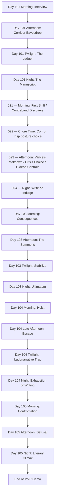
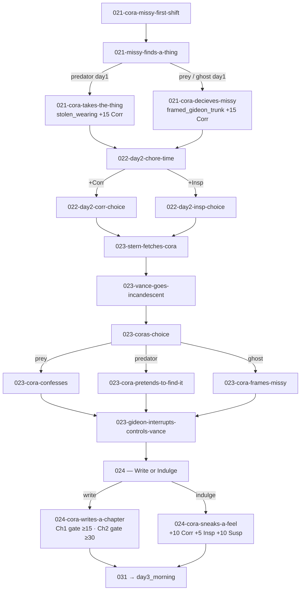

# Untitled Victorian VN — Storyboard (Release 1 - MVP)

> **Legend**
> 📌 Notes · 🚩 Flag Seeded · ⚖️ Stat Gated · 🚪 Branch Point

---

## Story Structure — MVP Path

### Day 102 — passage-level flow

Naming: Twine nodes remain **`[day][period]-[character/context]-[event]`** (e.g. `023-coras-choice`), but map to Ren'Py labels as **`day[Release][day]_[period]_[location/event]`** (e.g. `day102_3_coras_choice`). Script: [`day102_non_canon.rpy`](day102_non_canon.rpy).

| Passage | Label | Key flag / gate |
|---------|-------|-----------------|
| `021-cora-missy-first-shift` | `day102_1_cora_missy_first_shift` | — |
| `021-missy-finds-a-thing` | `day102_1_missy_finds_a_thing` | Branches on **`day1_corridor_choice`** |
| `021-cora-takes-the-thing` | `day102_1_cora_takes_the_thing` | **`day2_outfit_status = "stolen_wearing"`** +15 Corr |
| `021-cora-decieves-missy` | `day102_1_cora_decieves_missy` | **`day2_outfit_status = "framed_gideon_trunk"`** +15 Corr |
| `022-day2-chore-time` | `day102_2_day2_chore_time` | `show_ledger_ui()` before choice |
| `022-day2-corr-choice` | menu branch | +10 Corr +5 Susp |
| `022-day2-insp-choice` | menu branch | +10 Insp −5 Susp |
| `023-stern-fetches-cora` | `day102_3_stern_fetches_cora` | — |
| `023-vance-goes-incandescent` | `day102_3_vance_goes_incandescent` | — |
| `023-coras-choice` | `day102_3_coras_choice` | Menu sets **`day2_tea_choice`** |
| `023-cora-confesses` | menu branch | `"prey"` +10 Insp +15 Susp |
| `023-cora-pretends-to-find-it` | menu branch | `"predator"` +10 Corr +10 Susp |
| `023-cora-frames-missy` | menu branch | `"ghost"` +15 Corr |
| `023-gideon-interrupts-controls-vance` | `day102_3_gideon_interrupts_controls_vance` | Dialogue branches on `day2_tea_choice` |
| `024-cora-writes-a-chapter` | `day102_4_cora_writes_a_chapter` | Ch1 if `manuscript_progress==0` (≥15); Ch2 (≥30); increments `manuscript_progress` |
| `024-cora-sneaks-a-feel` | `day102_4_cora_sneaks_a_feel` | +10 Corr +5 Insp +10 Susp; no manuscript progress |

---

## Global State Tracking (Day 101-105)

### 🚩 Key Narrative Flags

| Flag Name | Set In | Function / Forward Impact |
|-----------|--------|---------------------------|
| `day1_corridor_choice` (draft) → **`story.day1_corridor_state`** in game | Day 101 Afternoon | Values `"none"` (default) / `"predator"` / `"prey"` / `"ghost"`. In runtime `renpy_project/game/`, set **only** via `story.set_corridor_state(...)` (whitelist in `classes.rpy`); do not assign the field in scripts. Determines Chapter One flavor text and CG branch. |
| `manuscript_progress` | Day 101 Night | Incremented by 1 on successful writing check; advances manuscript progression. |
| `day2_outfit_status` | Day 102 Morning (`021`) | `"stolen_wearing"` (predator day1 — Cora takes it) / `"framed_gideon_trunk"` (prey/ghost day1 — Missy plants it). Persists into Day 103 laundry inspection. |
| `day2_tea_choice` | Day 102 Afternoon (`023-coras-choice`) | `"predator"` (deflects/produces it) / `"prey"` (confesses) / `"ghost"` (frames Missy). Drives Day 102 chapter prose branch and Day 103 morning consequence. |
| `day3_brush_choice` | Day 103 Afternoon | Records response to Gideon mirror-test; informs characterization momentum. |
| `day3_ultimatum` | Day 103 Night | `"surrendered"` / `"barricaded"` records response to Gideon's 9 PM demand and chapter progression outcome. |
| `has_photograph` | Day 104 Escape | Core leverage gate; `False` routes Day 105 directly into fired fail state. |
| `day4_escape` | Day 104 Late Afternoon | `"fireplace"` / `"bold_lie"` / `"meat_shield"` controls suspicion profile and available twilight atonement text. |
| `day5_dynamic` | Day 105 Afternoon | `"muse"` / `"protege"` sets post-defusal relational framing with Gideon. |

### ⚖️ Hard Mechanic Gates

- **Day 101 Night — "The Manuscript" Writing Session:**
  - Requires **(Inspiration + Corruption) ≥ 15** to complete Chapter One.
  - Success increments `manuscript_progress` and branches by `day1_corridor_state` (draft name `day1_corridor_choice`).
  - Failure yields a blank-page outcome and pushes risk-taking pressure into Day 2.
- **Day 102 Night — `024-cora-writes-a-chapter` (Write or Indulge):**
  - If `manuscript_progress == 0` (Chapter One missed): gate is **(Inspiration + Corruption) ≥ 15**; prose branches on `day1_corridor_choice`.
  - If `manuscript_progress >= 1` (Chapter Two): gate is **(Inspiration + Corruption) ≥ 30**; prose branches on `day2_tea_choice`.
  - Choosing `024-cora-sneaks-a-feel` instead grants +10 Corr +5 Insp +10 Susp but forfeits manuscript progress for the night.
- **Day 103 Night — Ultimatum Defiance Gate:**
  - `Go to Him` always resolves with major stat gain but forfeits writing.
  - `Barricade the Door` requires **(Inspiration + Corruption ) ≥ 45** to produce Chapter Three.
- **Day 104 Twilight — Suspicion Soft Lock:**
  - Choosing to write adds **+15 Suspicion**.
  - If projected Suspicion reaches 100, writing is blocked and the player is looped back to safer choices.
- **Day 105 Morning — Leverage Hard Gate:**
  - `has_photograph == False` triggers immediate fail branch (`ending_fired_and_ruined`).

---

## Scene Ledger (Generated Non-Canon DB)

*Passage ids: **`0[day][scene]-[character/context]-[event]`** (lowercase, hyphens). Maps to Twine board and Ren'Py `day#_*` labels.*

### Day 101
- **101-01**: Morning Interview. Cora meets Stern and chooses meek facade vs visible competence (early Suspicion shaping).
- **101-02**: Corridor Collision. Vance lashes out; Gideon appears and immediately controls the dynamic.
- **101-03**: Laundry Introductions. Missy is established as naive ally/pawn.
- **101-04**: Corridor Eavesdrop Choice. Player secures material via Missy (`predator`), direct peeping risk (`prey`), or strategic withdrawal (`ghost`).
- **101-05**: Twilight Ledger Economy. One evening action adjusts stat posture before writing (Atonement / Gossip / Indulge).
- **101-06**: Night Manuscript Check. Chapter One written if threshold crossed; prose branch on corridor identity.

### Day 102
*(Source: [`day102_non_canon.rpy`](day102_non_canon.rpy))*
- **021-cora-missy-first-shift**: Master suite morning; Cora and Missy arrive to clean while guests are at breakfast.
- **021-missy-finds-a-thing**: Missy upends a hatbox and exposes explicit lingerie; branches immediately on **`day1_corridor_choice`**.
- **021-cora-takes-the-thing**: Predator day1 route — Cora takes the item and wears it. **`day2_outfit_status = "stolen_wearing"`** +15 Corr.
- **021-cora-decieves-missy**: Prey/ghost day1 route — Cora directs Missy to plant it in Gideon's trunk. **`day2_outfit_status = "framed_gideon_trunk"`** +15 Corr.
- **022-day2-chore-time**: Corridor chore run; `show_ledger_ui()` before choice; **`022-day2-corr-choice`** (+10 Corr, linger near suite) or **`022-day2-insp-choice`** (+10 Insp, work efficiently and catalogue).
- **023-stern-fetches-cora**: Stern intercepts Cora and sends her upstairs to a situation.
- **023-vance-goes-incandescent**: Vance confronts the room over the missing item; Stern and Cora both present.
- **023-coras-choice**: Three-way crisis menu → **`day2_tea_choice`**: confess (`"prey"`, +10 Insp +15 Susp) / pretend to find it (`"predator"`, +10 Corr +10 Susp) / frame Missy (`"ghost"`, +15 Corr).
- **023-gideon-interrupts-controls-vance**: Gideon enters, silences Vance, reads Cora; dialogue branches on `day2_tea_choice`. Flags whether Chapter One was missed.
- **024-cora-writes-a-chapter**: Night writing; Ch1 gate ≥15 (if `manuscript_progress==0`) or Ch2 gate ≥30; prose branches on corridor/vance choice; increments **`manuscript_progress`**.
- **024-cora-sneaks-a-feel**: Alternative to writing; sensory/indulgent introspection (outfit-status-aware); +10 Corr +5 Insp +10 Susp; no manuscript progress.

### Day 103
- **103-01**: Contextual Grind. Morning labor punishment shifts based on `day2_tea_choice`.
- **103-02**: The Summons. Gideon has Cora brush Vance's hair in a coercive mirror tableau.
- **103-03**: Mirror Test Choice. Accomplice/Deviant/Mouse branch records `day3_brush_choice`.
- **103-04**: 9 PM Command. Gideon orders unchaperoned tea, forcing a hard night decision.
- **103-05**: Ultimatum. Player either surrenders (stat gain, no chapter) or barricades for Chapter Three if gate is met.

### Day 104
- **104-01**: The Heist. Cora breaks Gideon's lockbox and discovers an explicit photograph with legal blackmail weight.
- **104-02**: The Escape. Return timing forces split-second survival method; sets `has_photograph` and `day4_escape`.
- **104-03**: Ludonarrative Trap. Twilight menu forces tradeoff between lowering suspicion and preserving writing throughput.
- **104-04**: Exhaustion Branch. High-risk survival cleanup preserves leverage but consumes writing window.
- **104-05**: Writing Branch. If chosen and allowed, Chapter Four is completed but with reduced narrative potency.

### Day 105
- **105-01**: Confrontation. Gideon interrogates Cora about lockbox breach; no-photo path collapses immediately to fail ending.
- **105-02**: Defusal. Even with leverage, class-power reality check strips legal advantage; motivation confession sets `day5_dynamic`.
- **105-03**: Funding and Entrapment. Gideon burns the photo, funds the manuscript, and binds Cora into future service.
- **105-04**: Literary Climax. Final chapter voice branches by dominant stat axis (corruption vs influence vs inspiration).
- **105-05**: Demo Cliffhanger. Morning tableau with Gideon/Vance ends in hard cut, positioning post-MVP escalation.

---

## Assets Checklist

### Backgrounds
- `bg_savoy_corridor_morning`
- `bg_laundry_room_day`
- `bg_servants_corridor_dim`
- `bg_servants_quarters_dusk`
- `bg_cora_desk_night`
- `bg_master_suite_day`
- `bg_master_suite_tea`
- `bg_servants_corridor_day`
- `bg_servants_corridor_morning`
- `bg_master_suite_night`
- `bg_master_suite_day` (day 5 confrontation/cliffhanger reuse)

### Music & Sound
- `themes/savoy_tension` (interview + corridor hierarchy)
- `themes/servants_floor_unease` (laundry/corridor)
- `themes/private_ink` (night writing sequence)
- `ambient/laundry_steam`
- `ambient/hotel_corridor_muffled`
- `ambient/servants_quarters_dusk`
- `sfx/corridor_slap_muffled`
- `sfx/floorboard_creak`
- `sfx/ink_scratch`
- `sfx/washbasin_clatter`
- `themes/master_suite_pressure`
- `themes/predator_game`
- `themes/defiance_and_dread`
- `ambient/master_suite_quiet`
- `ambient/fireplace_low`
- `sfx/lockpick_tension`
- `sfx/key_in_door`
- `sfx/brush_drop_clatter`
- `sfx/door_handle_jiggle`

### Character Sprites
- **Cora**: Chambermaid base, guarded, focused, flushed (writing variants).
- **Missy**: Smiling/naive, shocked, hesitant.
- **Vance**: Angry/indignant, submissive heel-shift.
- **Gideon**: Cold authority presence.
- **Ms. Stern**: Neutral appraising, stern reprimand.
- **Vance (extended)**: Cowed/defeated, mirror-watch terror.
- **Gideon (extended)**: Neutral interrogative, dominant proximity, angry confrontation.
