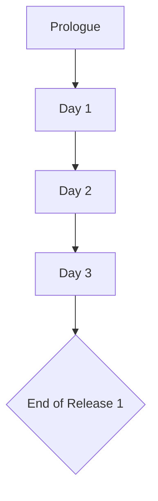

# Untitled Victorian VN — Storyboard (Release 1 - MVP)

> **Legend**
> 📌 Notes · 🚩 Flag Seeded · ⚖️ Stat Gated · 🚪 Branch Point

---

## Story Structure — MVP Path

---

## Global State Tracking (Days P–3)

### 🚩 Key Narrative Flags

| Flag Name | Set In | Function / Forward Impact |
|-----------|--------|---------------------------|
| `prologue_found` | Prologue | Overheard vs Read Letters; colors Cora's initial worldview. |
| `stern_first_impression` | Day 1 | Diligent vs Meek; influences Stern's baseline Suspicion and trust. |
| `dom_sub_flag` | Day 1 | Dominant vs Submissive; frames Cora's sexual awakening and unlocks specific scenes with Gideon/Vance. |
| `missy_flag` | Day 1 | Protect vs Corrupt; defines Cora's relationship with her naive co-worker. |
| `knickers_flag_planted` | Day 1 | True; explicitly sets up the theft arc for Day 2. |
| `volunteered_for_vance` | Day 2 | True/False; determines if Cora confronts Vance directly over the missing item. |
| `manuscript_reread` | Day 3 | True/False; adds corruption flavor dialogue in future chapters. |
| `missy_in_room_day3` | Day 3 | True/False; determines Missy's proximity to the master suite fallout. |
| `vance_noticed_cora` | Day 3 | True; unlocks private dominant-oriented encounters with Vance in Day 5+. |
| `vance_thaw` | Day 3 | True; unlocks gentler reconciliation arc with Vance. |
| `gideon_spoken_to` | Day 3 | True; expands Gideon's dialogue tree moving forward. |
| `manuscript_submitted` | Day 3 | True; unlocks the Holywell contact/payment chain. |
| `stern_trust_medium` | Day 3 | True; unlocks Stern providing intel or protection to Cora. |
| `manuscript_tone` | Day 3 | Dominant/Submissive; seeds the tone and framing for Chapter 3 of the book. |
| `chapter2_deferred` | Day 3 | True; explicitly forces the player to re-attempt the writing gate on Day 4. |

### ⚖️ Hard Mechanic Gates

- **Day 3 Evening — "The Reply" Writing Session:**
  - Requires **Inspiration ≥ 40** and **Corruption ≥ 30** to write Chapter Two.
  - Failure yields `chapter2_deferred` and forces the player to scrounge for stats on Day 4.

---

## Scene Ledger (Generated Non-Canon DB)

### Prologue
- **P-01**: The Train Journey.
- **P-02**: The Discovery (Flashback). Player chooses to investigate the noise (`+Corr`) or read the letters at the desk (`+Insp`).
- **P-03**: Awakening. Gathering the papers on the train.

### Day 1
- **1-01**: The Interview. Player chooses to be diligent or meek with Stern.
- **1-02**: A Proper Dressing Down. Vance yells at Cora; Gideon asserts dominance over Vance.
- **1-03**: The Laundry. Cora meets Missy.
- **1-04**: The Corridor Tease. Deciding whether to focus on protecting/corrupting Missy (`missy_flag`) or watching the master suite (`dom_sub_flag`).
- **1-05**: The Nightly Ink. Cora struggles to write.
- **1-06**: The Snooping Errand. Cora uses Insp or Corr to convince Missy to enter the master suite and find the scandalous undergarments.

### Day 2
- **2-01**: The Dry Pen. Morning reflection and defining sources of inspiration.
- **2-02**: The Accusation. Vance discovers the theft; Stern defends the staff; Gideon silences Vance.
- **2-03**: The Revelation. Cora confirms to herself that she kept the item.
- **2-04**: The Volunteer. Stern asks for an attendant to assist Vance. Player chooses to step up or send Ellen.
- **2-05**: The Discovery (If Volunteered). Cora "finds" the item via her person (high suspicion) or the wardrobe (Vance humiliated). Gideon disciplines Vance.
- **2-06**: Stern's Warning. Conditional scene if Suspicion > 30.
- **2-07**: The First Chapter. Cora successfully finishes writing the scene based on the day's tension.

### Day 3
- **3-01**: The Weight of What Was Written. Reading the chapter vs. sealing it. Missy warns of Vance's demands.
- **3-02**: The Vance Room (Again). Deflecting, sympathizing, or holding Vance's gaze. Engaging Gideon.
- **3-03**: The Drop. Cheapside alley submission of the manuscript.
- **3-04**: Stern's Ledger. Explaining absence.
- **3-05**: The Reply. Writing Gate for Chapter 2. Determining tone of the next chapter.

---

## Assets Checklist

### Backgrounds
- `interior/train_carriage_day`
- `interior/country_estate_study`
- `interior/savoy_corridor_morning`
- `interior/sterns_office`
- `interior/savoy_lobby_stairs`
- `interior/servants_laundry_afternoon`
- `interior/servants_corridor` (variants: morning, night)
- `interior/coras_room_morning` (variants: desk_closeup)
- `interior/coras_room_evening` (variants: desk_lamp)
- `interior/master_suite_morning`
- `interior/master_suite_afternoon`
- `interior/master_suite_night`
- `exterior/cheapside_alley`

### Music & Sound
- `themes/melancholy`
- `themes/threshold`
- `themes/quiet_dread`
- `themes/temptation_understated`
- `ambient/servants_corridor`
- `ambient/upper_corridor_tension`
- `ambient/office_quiet`
- `ambient/room_at_night`
- `sfx/train_whistle`
- `sfx/loud_knocking`

### Character Sprites
- **Cora**: Neutral traveling attire, chambermaid uniform, shift/tired, nightgown/flush, outdoor dress.
- **Missy**: Chambermaid uniform, doorway/worried.
- **Vance**: Daywear (angry/indignant), peignoir/vanity, back-to-camera reflection.
- **Gideon**: Tailored evening wear, morning dress.
- **Ms. Stern**: Crisp uniform, standing, at desk/ledger.
