# Untitled Victorian VN — Storyboard (Release 1 - MVP)

> **Legend**
> 📌 Notes · 🚩 Flag Seeded · ⚖️ Stat Gated · 🚪 Branch Point

---

## Story Structure — MVP Path

```mermaid
flowchart TD
    D100[Day 100 Prologue: The Train & The Discovery] --> D101M[Day 101 Morning: Interview & Collision]
    D101M --> D101A[Day 101 Afternoon: Corridor Eavesdrop]
    D101A --> D101T[Day 101 Twilight: The Ledger]
    D101T --> D101N[Day 101 Night: The Manuscript]
    D101N --> D102M[Day 102 Morning: First Shift / Contraband Discovery]
    D102M --> D102C[Day 102 Chore Time: Corridor vs Inspiration]
    D102C --> D102A[Day 102 Afternoon: Vance's Meltdown / Crisis Choice]
    D102A --> D102N[Day 102 Night: Write or Indulge]
    D102N --> D103M[Day 103 Morning: Consequences & Grind]
    D103M --> D103A[Day 103 Afternoon: The Summons / Brush Test]
    D103A --> D103T[Day 103 Twilight: Stabilize or Write]
    D103T --> D103N[Day 103 Night: Ultimatum Defiance / Bargain]
    D103N --> D104M[Day 104 Morning: Heist & Lockbox Breach]
    D104M --> D104A[Day 104 Late Afternoon: Early Return & Escape]
    D104A --> D104T[Day 104 Twilight: Suspicion Trap vs Repair]
    D104T --> D104N[Day 104 Night: Triumphant Chapter / Exhaustion]
    D104N --> D105M[Day 105 Morning: The Summons]
    D105M --> D105A[Day 105 Afternoon: Leverage Collapses / Interrogation]
    D105A --> D105N[Day 105 Night: Manuscript Reckoning & Final Cut]
    D105N --> End[End of MVP Demo]
```

---

## Coding, Class, and Style Conventions
> **Adherence to `chief_architect.md` rules is mandatory.**

1. **State Contract Integrity**: All flags are maintained within the `StoryState` class layer via setters (e.g., `story.set_corridor_state("prey")`). No ad hoc `default story.day1_corridor_state = ...` assignments in episodic scripts. Mutually exclusive branches use a single string and a whitelisted setter.
2. **Label Naming**: `day[R][dd]_[p]_[location_description]` where R is Release (1) and dd is the day (01-05). Example: `day103_2_suite_gideon_tea`.
3. **Symbols & Speakers**: All speaker tokens (e.g., `cora`, `stern`) must map to defined `Character` objects in `characters.rpy`. All stat effects must use `apply_effects()`.
4. **Passage-Level Design**: Non-canon drafts serve as **design intent**. They hold the narrative structure, the dialogue, and the flow, which are then strictly parsed into the canon `dayrdd.rpy` scripts.

---

## Global State Tracking (Day 100-105)

### 🚩 Key Narrative Flags

| Flag Name | Set In | Function / Forward Impact |
|-----------|--------|---------------------------|
| `prologue_found` | Day 100 | `"overheard"` or `"read_letters"` — seeds Cora's initial thematic inclination. |
| `story.day1_interview_state` | Day 101 | `"meek"` / `"competent"` — early suspicion shaping with Stern. |
| `story.day1_corridor_state` | Day 101 | `"predator"` / `"prey"` / `"ghost"` — determines Chapter 1 prose and Day 2's contraband branch. |
| `story.day1_ledger_focus` | Day 101 | `"inspiration"` / `"corruption"` — dictates the framing of the writing or indulgence. |
| `story.missy_day1_trust_state` | Day 101 | `"soothed"` / `"unsettled"` / `"warned_cora"` / `"shared_caution"` — tracks early relationship with Missy. |
| `story.day2_contraband_state` | Day 102 | `"stolen_wearing"` / `"planted_in_trunk"` — outcome of the morning discovery; shapes the tea crisis. |
| `story.day2_tea_choice` | Day 102 | `"prey"` (confess) / `"predator"` (pretend to find) / `"ghost"` (frame Missy) — drives the Day 3 consequence. |
| `story.missy_day2_trust_break` | Day 102 | Boolean — True if Missy is framed (`"ghost"`). |
| `story.day3_brush_choice` | Day 103 | `"predator"` (accomplice) / `"prey"` (deviant) / `"ghost"` (mouse) — Gideon mirror test. |
| `story.day3_ultimatum` | Day 103 | `"defied"` / `"bargained"` / `"surrendered"` — response to Gideon's 9 PM demand. |
| `story.day4_escape_state` | Day 104 | `"fireplace"` / `"bold_lie"` / `"missy_cover"` — survival method affecting suspicion and Missy. |
| `story.has_photograph` | Day 104 | Boolean — True if Cora escaped with the evidence. |
| `story.day5_dynamic` | Day 105 | `"muse"` / `"protege"` / `"adversary"` / `"witness"` — Gideon's assessment of Cora's true motivation. |
| `story.day5_money_choice` | Day 105 | `"taken"` / `"refused"` / `"deferred"` — affects entanglement for Release 2. |
| `story.cora_release1_flavour` | Day 105 | `"observer"` / `"predator"` / `"prey"` / `"ghost"` — carries forward Cora's accumulated archetype. |

### ⚖️ Hard Mechanic Gates

- **Day 101 Night:** Writing Chapter One requires **(Inspiration + Corruption) ≥ 15**. Failure skips the chapter.
- **Day 102 Night:** Writing Chapter Two requires **Ch1 gate ≥ 15** (if missed) or **Ch2 gate ≥ 30**. Alternative indulgence trades manuscript progress for stats.
- **Day 103 Night:** Barricading the door for Chapter Three requires **(Inspiration + Corruption) ≥ 45**.
- **Day 104 Twilight:** If **Suspicion ≥ 85**, writing is blocked (Cora is too paralyzed by fear). She must choose safety/atonement.
- **Day 105 Morning:** Leverage defusal is structural. The photograph cannot defeat Gideon's class privilege, but the motivation confessed shapes Cora's arc and ending manuscript reckoning.

---

## Scene Ledger & Passage Flow

### Day 100 (Prologue)
*Source: `day100_non_canon.rpy`*
- **`day100_main`**: Train journey to London.
- **Flashback**: Cora's dismissal from the country estate after a discovery (`prologue_found`).
- **Awakening**: Cora arriving in London with a forbidden manuscript and forged references.

### Day 101
*Source: `day101_non_canon.rpy`*
- **`day101_1_cora_waiting` & `_morning_interview`**: First encounter with Stern. Choice between `"meek"` or `"competent"`.
- **`day101_1_vance_throws_toy`**: Initial corridor collision with Vance and Gideon.
- **`day101_2_missy_meets_cora` & `_coras_path_choice`**: Laundry room intro. The eavesdrop event that branches `day1_corridor_state` (`"predator"`, `"prey"`, `"ghost"`).
- **`day101_3_taking_stock_day1`**: Ledger choice between `"inspiration"` (structural) or `"corruption"` (appetite).
- **`day101_4_writing_or_visiting`**: Choice to write (Chapter 1) or visit Missy to establish relationship seeds.

### Day 102
*Source: `day102_non_canon.rpy`*
- **`day102_1_cora_missy_first_shift` & `_missy_finds_a_thing`**: Missy discovers contraband.
- **`day102_1_cora_takes_the_thing` / `_deceives_missy`**: Branch dictated by Day 1 corridor choice. Cora either wears the stolen item or plants it.
- **`day102_2_day2_chore_time`**: Ledger choice (Insp/Corr) while working the corridor.
- **`day102_3_stern_fetches_cora` & `_vance_goes_incandescent`**: The crisis begins over the missing item.
- **`day102_3_coras_choice`**: The massive three-way branch -> `day2_tea_choice` (`"prey"`, `"predator"`, `"ghost"`).
- **`day102_3_gideon_interrupts_controls_vance`**: Gideon diffuses the situation to maintain quiet, observing Cora.
- **`day102_4_cora_writes_a_chapter` / `_sneaks_a_feel`**: Night writing check (Ch1/Ch2) or indulgence.

### Day 103
*Source: `day103_non_canon.rpy`*
- **`day103_1`**: Morning consequence of Day 2 choices (Vance's wrath, Stern's inspection, or Missy's silence).
- **`day103_2_suite_gideon_tea` & `_cora_vs_gideon`**: Cora is summoned. The Hairbrush Test (`day3_brush_choice`).
- **`day103_2_suite_gideon_beat`**: Gideon orders her to return at 9 PM alone.
- **`day103_3_bedroom_cora_frantic_writing_event`**: Twilight action. Frantic write, mask prep, or indulging the words.
- **`day103_4_room_stern_suspicion`**: Stern questions Cora's summons.
- **`day103_2_suite_night_tea`**: The 9 PM encounter. Ultimatum choice: `"defied"`, `"bargained"`, `"surrendered"`.
- **`day103_3_bedroom_final_write`**: Write the chapter (requires high stats) or barricade the door.

### Day 104
*Source: `day104_non_canon.rpy`*
- **`day104_1_false_dawn_suite_window` & `_lockbox_evidence`**: Cora breaks into the lockbox and discovers the photograph.
- **`day104_2_return_early` & Escape**: Gideon and Vance return. Cora escapes via `"fireplace"` (soot), `"bold_lie"` (visible), or `"missy_cover"` (betrayal).
- **`day104_3_stern_pressure`**: Dealing with Stern's suspicion.
- **`day104_4_twilight_ledger_false_dawn`**: The Suspicion soft lock. Atonement or Missy Repair vs Triumphant Write.
- **`day104_5_triumphant_chapter` / `_false_dawn_ending`**: If safe, Cora completes a triumphant "false dawn" chapter.

### Day 105
*Source: `day105_non_canon.rpy`*
- **`day105_1_monster_reemerges` & `_the_summons`**: The false dawn ends. Gideon summons Cora over the lockbox.
- **`day105_3_leverage_collapses`**: Gideon dismantles the notion that a servant's truth matters against class structure.
- **`day105_4_why_did_you_do_it`**: Cora's motivation sets `day5_dynamic` (`"muse"`, `"protege"`, `"adversary"`, `"witness"`).
- **`day105_5_gideon_marks_cora`**: Evidence is burned/secured. Gideon leaves a money envelope.
- **`day105_6_manuscript_reckoning`**: Night writing. The final MVP chapter is written, reframing the story.
- **`day105_7_release_one_ending`**: Morning departure. Gideon marks Cora. Carry-forward flags are set for Release 2.

---

## Assets Checklist

### Backgrounds
- `interior/train_carriage (day)` (Day 100)
- `interior/country_estate_study` (Day 100)
- `bg_savoy_corridor (morning)`
- `bg_laundry_room (day)`
- `bg_servants_corridor (dim, day, morning)`
- `bg_servants_quarters (dusk)`
- `bg_cora_desk (night)`
- `bg_master_suite (day, tea, night)`

### Music & Sound
- `themes/melancholy`
- `sfx/train_whistle`
- `themes/savoy_tension`
- `themes/servants_floor_unease`
- `themes/private_ink`
- `themes/master_suite_pressure`
- `themes/predator_game`
- `themes/defiance_and_dread`
- `ambient/laundry_steam`
- `ambient/hotel_corridor_muffled`
- `ambient/servants_quarters_dusk`
- `ambient/master_suite_quiet`
- `ambient/fireplace_low`
- `sfx/corridor_slap_muffled`
- `sfx/floorboard_creak`
- `sfx/ink_scratch`
- `sfx/washbasin_clatter`
- `sfx/lockpick_tension`
- `sfx/key_in_door`
- `sfx/brush_drop_clatter`
- `sfx/door_handle_jiggle`

### Character Sprites
- **Cora**: (Implied base presence, guarded, focused, flushed)
- **Missy**: `smiling`, `shocked`, `confused`
- **Vance**: `angry`, `submissive`, `defeated`, `cowed`, `confused`
- **Gideon**: `cold`, `neutral`, `dominant`, `angry`
- **Ms. Stern**: `neutral`, `stern`

### CG / UI Callouts
- `show_ledger_ui()`
- `cg_gideon_photograph` (Day 104/105)
- `cg_photograph_burning` (Day 105)
