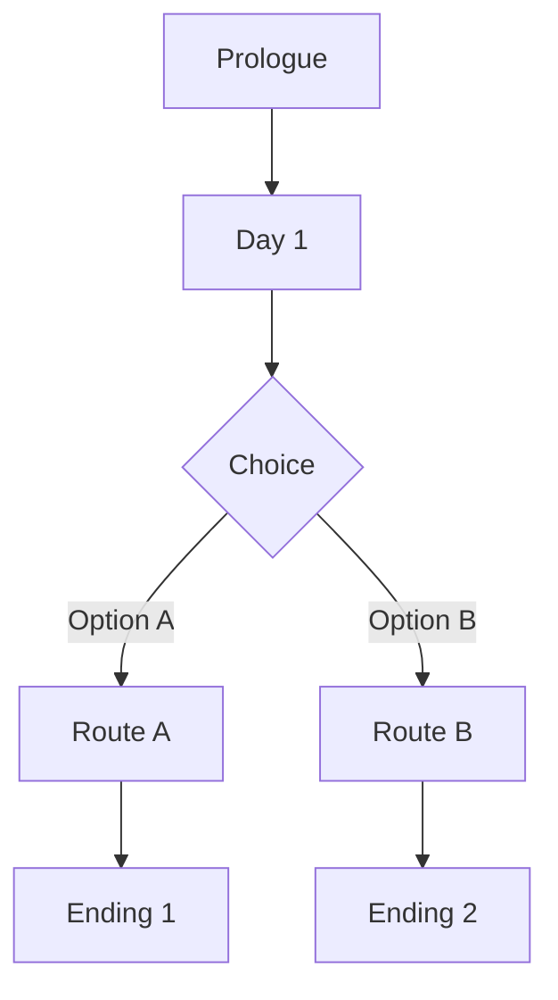

# Untitled Victorian VN — Storyboard

> **Legend**
> `[bg]` Background · `[char]` Character · `[sfx]` Sound effect · `[mus]` Music · `[choice]` Player choice · `[flag]` Variable/flag

---

## Story Structure



---

## Characters

| Name | Role | Description |
|------|------|-------------|
| — | Protagonist | |
| — | Love Interest | |

---

## Scenes

### Prologue

**Scene P-01 — [Location Name]**

| Element | Value |
|---------|-------|
| `[bg]` | exterior/victorian_street_day |
| `[mus]` | themes/melancholy |
| `[char]` | — |

> *Narration text goes here.*

```
CHARACTER "Dialogue goes here."
```

---

### Day 1

**Scene 1-01 — [Location Name]**

| Element | Value |
|---------|-------|
| `[bg]` | |
| `[mus]` | |
| `[char]` | |

> *Narration.*

```
CHARACTER "Dialogue."
```

#### `[choice]` Decision Point

- **Option A** → `[flag]` set `route_a = True` → Scene 1-02a
- **Option B** → `[flag]` set `route_b = True` → Scene 1-02b

---

## Flags & Variables

| Variable | Type | Default | Purpose |
|----------|------|---------|---------|
| `route_a` | bool | False | |
| `route_b` | bool | False | |

---

## Assets Checklist

### Backgrounds
- [ ] `victorian_street_day`

### Music
- [ ] `themes/melancholy`

### Characters
- [ ] Protagonist sprites (neutral, happy, sad)
