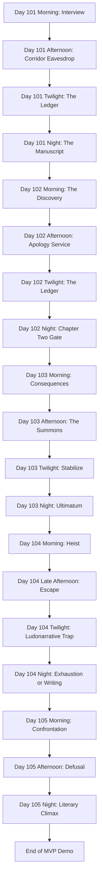

# Untitled Victorian VN — Storyboard (Release 1 - MVP)

> **Legend**
> 📌 Notes · 🚩 Flag Seeded · ⚖️ Stat Gated · 🚪 Branch Point

---

## Story Structure — MVP Path

---

## Global State Tracking (Day 101-105)

### 🚩 Key Narrative Flags

| Flag Name | Set In | Function / Forward Impact |
|-----------|--------|---------------------------|
| `day1_corridor_choice` (draft) → **`story.day1_corridor_state`** in game | Day 101 Afternoon | Values `"none"` (default) / `"predator"` / `"prey"` / `"ghost"`. In runtime `renpy_project/game/`, set **only** via `story.set_corridor_state(...)` (whitelist in `classes.rpy`); do not assign the field in scripts. Determines Chapter One flavor text and CG branch. |
| `manuscript_progress` | Day 101 Night | Incremented by 1 on successful writing check; advances manuscript progression. |
| `day2_outfit_status` | Day 102 Morning | `"stolen_wearing"` / `"framed_gideon_trunk"` / `"put_back"` tracks contraband handling and later risk text. |
| `day2_tea_choice` | Day 102 Afternoon | `"predator"` / `"prey"` / `"ghost"` drives Day 102 chapter tone and Day 103 consequence framing. |
| `day3_brush_choice` | Day 103 Afternoon | Records response to Gideon mirror-test; informs characterization momentum. |
| `day3_ultimatum` | Day 103 Night | `"surrendered"` / `"barricaded"` records response to Gideon's 9 PM demand and chapter progression outcome. |
| `has_photograph` | Day 104 Escape | Core leverage gate; `False` routes Day 105 directly into fired fail state. |
| `day4_escape` | Day 104 Late Afternoon | `"fireplace"` / `"bold_lie"` / `"meat_shield"` controls suspicion profile and available twilight atonement text. |
| `day5_dynamic` | Day 105 Afternoon | `"muse"` / `"protege"` sets post-defusal relational framing with Gideon. |

### ⚖️ Hard Mechanic Gates

- **Day 101 Night — "The Manuscript" Writing Session:**
  - Requires **(Inspiration + Corruption ) ≥ 15** to complete Chapter One.
  - Success increments `manuscript_progress` and branches by `day1_corridor_state` (draft name `day1_corridor_choice`).
  - Failure yields a blank-page outcome and pushes risk-taking pressure into Day 2.
- **Day 102 Night — Chapter Two Writing Gate:**
  - Requires **(Inspiration + Corruption ) ≥ 30**.
  - Success increments `manuscript_progress`; prose tone branches by `day2_tea_choice`.
- **Day 103 Night — Ultimatum Defiance Gate:**
  - `Go to Him` always resolves with major stat gain but forfeits writing.
  - `Barricade the Door` requires **(Inspiration + Corruption ) ≥ 45** to produce Chapter Three.
- **Day 104 Twilight — Suspicion Soft Lock:**
  - Choosing to write adds **+15 Suspicion**.
  - If projected Suspicion reaches 100, writing is blocked and the player is looped back to safer choices.
- **Day 105 Morning — Leverage Hard Gate:**
  - `has_photograph == False` triggers immediate fail branch (`ending_fired_and_ruined`).

---

## Scene Ledger (Generated Non-Canon DB)

### Day 101
- **101-01**: Morning Interview. Cora meets Stern and chooses meek facade vs visible competence (early Suspicion shaping).
- **101-02**: Corridor Collision. Vance lashes out; Gideon appears and immediately controls the dynamic.
- **101-03**: Laundry Introductions. Missy is established as naive ally/pawn.
- **101-04**: Corridor Eavesdrop Choice. Player secures material via Missy (`predator`), direct peeping risk (`prey`), or strategic withdrawal (`ghost`).
- **101-05**: Twilight Ledger Economy. One evening action adjusts stat posture before writing (Atonement / Gossip / Indulge).
- **101-06**: Night Manuscript Check. Chapter One is written if combined creative-moral pressure crosses threshold; prose branch depends on corridor identity.

### Day 102
- **102-01**: The Discovery. Contraband found during suite cleaning; player chooses theft, framing, or denial (`day2_outfit_status`).
- **102-02**: Apology Service. Stern sends Cora with tea; Gideon stages a loaded social test in front of subdued Vance.
- **102-03**: Subtext Duel. Response style sets `day2_tea_choice` and stat trajectory.
- **102-04**: Twilight Regulation. Ledger action rebalances suspicion/corruption before writing.
- **102-05**: Chapter Two Gate. Threshold check determines whether manuscript advances to Chapter Two.

### Day 103
- **103-01**: Contextual Grind. Morning labor punishment shifts based on `day2_tea_choice`.
- **103-02**: The Summons. Gideon has Cora brush Vance's hair in a coercive mirror tableau.
- **103-03**: Mirror Test Choice. Accomplice/Deviant/Mouse branch records `day3_brush_choice`.
- **103-04**: 9 PM Command. Gideon orders unchaperoned tea, forcing a hard night decision.
- **103-05**: Ultimatum. Player either surrenders (stat gain, no chapter) or barricades for Chapter Three if gate is met.

### Day 104
- **104-01**: The Heist. Cora breaks Gideon's lockbox and discovers an explicit photograph with legal blackmail weight.
- **104-02**: The Escape. Return timing forces split-second survival method; sets `has_photograph` and `day4_escape`.
- **104-03**: Ludonarrative Trap. Twilight menu forces tradeoff between lowering suspicion and preserving writing throughput.
- **104-04**: Exhaustion Branch. High-risk survival cleanup preserves leverage but consumes writing window.
- **104-05**: Writing Branch. If chosen and allowed, Chapter Four is completed but with reduced narrative potency.

### Day 105
- **105-01**: Confrontation. Gideon interrogates Cora about lockbox breach; no-photo path collapses immediately to fail ending.
- **105-02**: Defusal. Even with leverage, class-power reality check strips legal advantage; motivation confession sets `day5_dynamic`.
- **105-03**: Funding and Entrapment. Gideon burns the photo, funds the manuscript, and binds Cora into future service.
- **105-04**: Literary Climax. Final chapter voice branches by dominant stat axis (corruption vs influence vs inspiration).
- **105-05**: Demo Cliffhanger. Morning tableau with Gideon/Vance ends in hard cut, positioning post-MVP escalation.

---

## Assets Checklist

### Backgrounds
- `bg_savoy_corridor_morning`
- `bg_laundry_room_day`
- `bg_servants_corridor_dim`
- `bg_servants_quarters_dusk`
- `bg_cora_desk_night`
- `bg_master_suite_day`
- `bg_master_suite_tea`
- `bg_servants_corridor_day`
- `bg_servants_corridor_morning`
- `bg_master_suite_night`
- `bg_master_suite_day` (day 5 confrontation/cliffhanger reuse)

### Music & Sound
- `themes/savoy_tension` (interview + corridor hierarchy)
- `themes/servants_floor_unease` (laundry/corridor)
- `themes/private_ink` (night writing sequence)
- `ambient/laundry_steam`
- `ambient/hotel_corridor_muffled`
- `ambient/servants_quarters_dusk`
- `sfx/corridor_slap_muffled`
- `sfx/floorboard_creak`
- `sfx/ink_scratch`
- `sfx/washbasin_clatter`
- `themes/master_suite_pressure`
- `themes/predator_game`
- `themes/defiance_and_dread`
- `ambient/master_suite_quiet`
- `ambient/fireplace_low`
- `sfx/lockpick_tension`
- `sfx/key_in_door`
- `sfx/brush_drop_clatter`
- `sfx/door_handle_jiggle`

### Character Sprites
- **Cora**: Chambermaid base, guarded, focused, flushed (writing variants).
- **Missy**: Smiling/naive, shocked, hesitant.
- **Vance**: Angry/indignant, submissive heel-shift.
- **Gideon**: Cold authority presence.
- **Ms. Stern**: Neutral appraising, stern reprimand.
- **Vance (extended)**: Cowed/defeated, mirror-watch terror.
- **Gideon (extended)**: Neutral interrogative, dominant proximity, angry confrontation.
